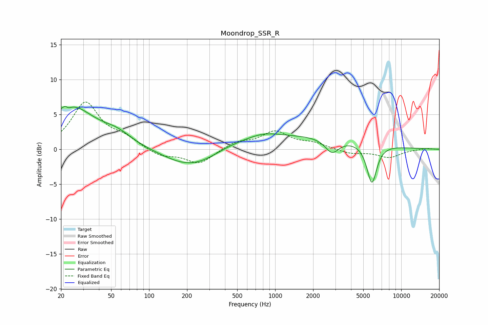

# Moondrop_SSR_R
See [usage instructions](https://github.com/jaakkopasanen/AutoEq#usage) for more options and info.

### Parametric EQs
Apply preamp of -6.2 dB when using parametric equalizer.

|   # | Type    |   Fc (Hz) |    Q |   Gain (dB) |
|-----|---------|-----------|------|-------------|
|   1 | Peaking |        22 | 5.97 |         3.2 |
|   2 | Peaking |        22 | 5.79 |        -3.2 |
|   3 | Peaking |        24 | 0.75 |         6   |
|   4 | Peaking |        56 | 1.2  |         1.4 |
|   5 | Peaking |       195 | 0.72 |        -2.4 |
|   6 | Peaking |       278 | 0.92 |        -1   |
|   7 | Peaking |       813 | 1.26 |         0.6 |
|   8 | Peaking |      1166 | 0.18 |         2   |
|   9 | Peaking |      2825 | 2.57 |        -2.1 |
|  10 | Peaking |      5844 | 3.49 |        -5.7 |

### Fixed Band EQs
When using fixed band (also called graphic) equalizer, apply preamp of **-6.9 dB** (if available) and set gains manually with these parameters.

|   # | Type    |   Fc (Hz) |    Q |   Gain (dB) |
|-----|---------|-----------|------|-------------|
|   1 | Peaking |        31 | 1.41 |         6.6 |
|   2 | Peaking |        62 | 1.41 |         1.4 |
|   3 | Peaking |       125 | 1.41 |        -1.1 |
|   4 | Peaking |       250 | 1.41 |        -2.1 |
|   5 | Peaking |       500 | 1.41 |         1   |
|   6 | Peaking |      1000 | 1.41 |         2.4 |
|   7 | Peaking |      2000 | 1.41 |         0.8 |
|   8 | Peaking |      4000 | 1.41 |        -0.6 |
|   9 | Peaking |      8000 | 1.41 |        -1.1 |
|  10 | Peaking |     16000 | 1.41 |         0.2 |

### Graphs

