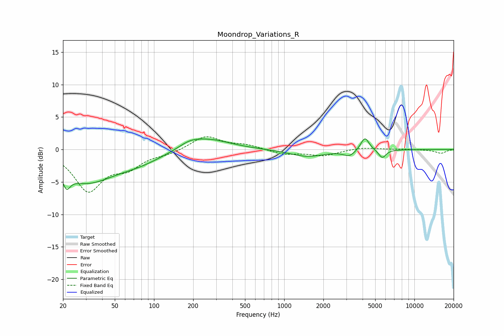

# Moondrop_Variations_R
See [usage instructions](https://github.com/jaakkopasanen/AutoEq#usage) for more options and info.

### Parametric EQs
Apply preamp of -1.7 dB when using parametric equalizer.

|   # | Type    |   Fc (Hz) |    Q |   Gain (dB) |
|-----|---------|-----------|------|-------------|
|   1 | Peaking |        21 | 5.94 |         3.2 |
|   2 | Peaking |        21 | 5.66 |        -5.3 |
|   3 | Peaking |        30 | 0.66 |        -4.7 |
|   4 | Peaking |        77 | 0.75 |        -1.4 |
|   5 | Peaking |       188 | 1.74 |         0.8 |
|   6 | Peaking |       259 | 0.83 |         1.7 |
|   7 | Peaking |      1504 | 1.03 |        -1.1 |
|   8 | Peaking |      3166 | 3.15 |        -0.9 |
|   9 | Peaking |      4166 | 4.39 |         2.1 |
|  10 | Peaking |      5664 | 4.84 |        -1.3 |

### Fixed Band EQs
When using fixed band (also called graphic) equalizer, apply preamp of **-2.1 dB** (if available) and set gains manually with these parameters.

|   # | Type    |   Fc (Hz) |    Q |   Gain (dB) |
|-----|---------|-----------|------|-------------|
|   1 | Peaking |        31 | 1.41 |        -6.1 |
|   2 | Peaking |        62 | 1.41 |        -2.3 |
|   3 | Peaking |       125 | 1.41 |        -0.6 |
|   4 | Peaking |       250 | 1.41 |         2.1 |
|   5 | Peaking |       500 | 1.41 |         0.6 |
|   6 | Peaking |      1000 | 1.41 |        -0.7 |
|   7 | Peaking |      2000 | 1.41 |        -0.9 |
|   8 | Peaking |      4000 | 1.41 |         0.3 |
|   9 | Peaking |      8000 | 1.41 |         0.1 |
|  10 | Peaking |     16000 | 1.41 |        -0.6 |

### Graphs

