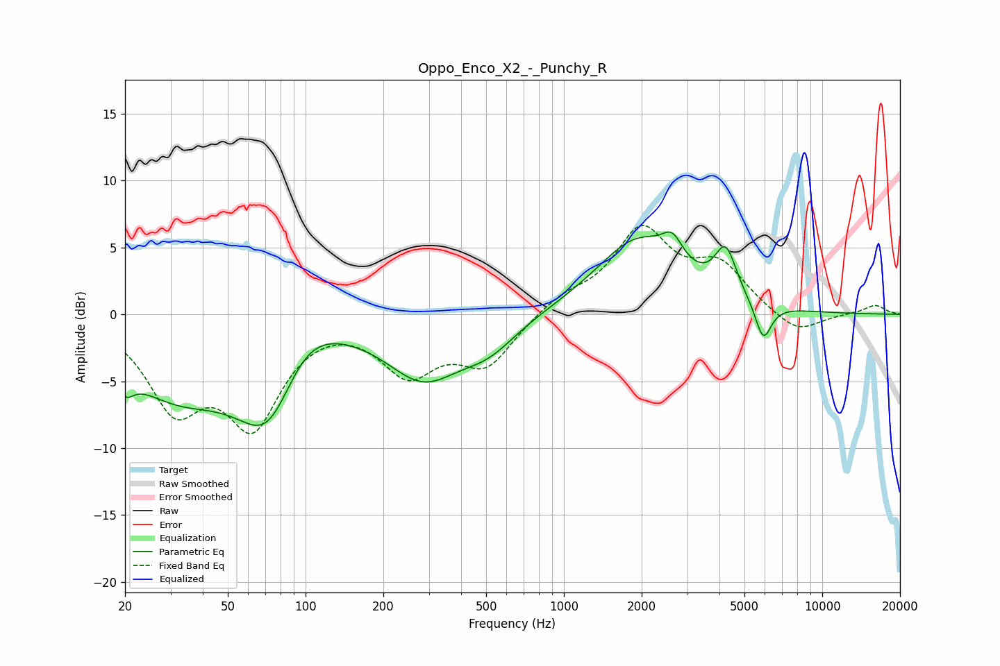

# Oppo_Enco_X2_-_Punchy_R
See [usage instructions](https://github.com/jaakkopasanen/AutoEq#usage) for more options and info.

### Parametric EQs
Apply preamp of -6.2 dB when using parametric equalizer.

|   # | Type    |   Fc (Hz) |    Q |   Gain (dB) |
|-----|---------|-----------|------|-------------|
|   1 | Peaking |        20 | 4.36 |        -1.7 |
|   2 | Peaking |        31 | 0.64 |        -5.3 |
|   3 | Peaking |        73 | 1.06 |        -8.8 |
|   4 | Peaking |        94 | 1.03 |         4.5 |
|   5 | Peaking |       286 | 0.97 |        -4.4 |
|   6 | Peaking |       512 | 1.25 |        -1.9 |
|   7 | Peaking |      1936 | 0.87 |         5.5 |
|   8 | Peaking |      2629 | 3.63 |         1.7 |
|   9 | Peaking |      4230 | 3.37 |         3.5 |
|  10 | Peaking |      5911 | 4.36 |        -2.9 |

### Fixed Band EQs
When using fixed band (also called graphic) equalizer, apply preamp of **-6.7 dB** (if available) and set gains manually with these parameters.

|   # | Type    |   Fc (Hz) |    Q |   Gain (dB) |
|-----|---------|-----------|------|-------------|
|   1 | Peaking |        31 | 1.41 |        -6.3 |
|   2 | Peaking |        62 | 1.41 |        -7.5 |
|   3 | Peaking |       125 | 1.41 |         0.2 |
|   4 | Peaking |       250 | 1.41 |        -4.1 |
|   5 | Peaking |       500 | 1.41 |        -3.6 |
|   6 | Peaking |      1000 | 1.41 |         1.2 |
|   7 | Peaking |      2000 | 1.41 |         6.1 |
|   8 | Peaking |      4000 | 1.41 |         3.3 |
|   9 | Peaking |      8000 | 1.41 |        -1.6 |
|  10 | Peaking |     16000 | 1.41 |         0.7 |

### Graphs

