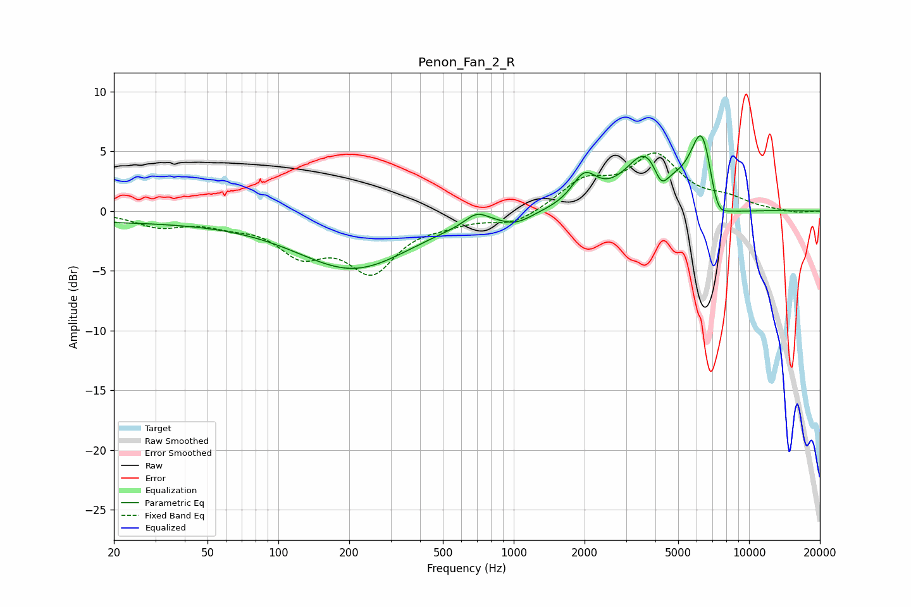

# Penon_Fan_2_R
See [usage instructions](https://github.com/jaakkopasanen/AutoEq#usage) for more options and info.

### Parametric EQs
Apply preamp of -6.4 dB when using parametric equalizer.

|   # | Type    |   Fc (Hz) |    Q |   Gain (dB) |
|-----|---------|-----------|------|-------------|
|   1 | Peaking |        20 | 0.2  |        -0.8 |
|   2 | Peaking |       210 | 0.58 |        -4.7 |
|   3 | Peaking |       696 | 2.91 |         1   |
|   4 | Peaking |      1022 | 2.13 |        -0.8 |
|   5 | Peaking |      1997 | 2.66 |         2.5 |
|   6 | Peaking |      3694 | 1.55 |         4.8 |
|   7 | Peaking |      4226 | 4.17 |        -2.2 |
|   8 | Peaking |      6331 | 2.67 |         7.2 |
|   9 | Peaking |      7290 | 3.52 |        -2.5 |
|  10 | Peaking |      7632 | 1.31 |        -1.2 |

### Fixed Band EQs
When using fixed band (also called graphic) equalizer, apply preamp of **-5.0 dB** (if available) and set gains manually with these parameters.

|   # | Type    |   Fc (Hz) |    Q |   Gain (dB) |
|-----|---------|-----------|------|-------------|
|   1 | Peaking |        31 | 1.41 |        -1.2 |
|   2 | Peaking |        62 | 1.41 |        -0.8 |
|   3 | Peaking |       125 | 1.41 |        -3.1 |
|   4 | Peaking |       250 | 1.41 |        -4.6 |
|   5 | Peaking |       500 | 1.41 |        -0.7 |
|   6 | Peaking |      1000 | 1.41 |        -1.1 |
|   7 | Peaking |      2000 | 1.41 |         2.3 |
|   8 | Peaking |      4000 | 1.41 |         4.4 |
|   9 | Peaking |      8000 | 1.41 |         0.8 |
|  10 | Peaking |     16000 | 1.41 |        -0.2 |

### Graphs

