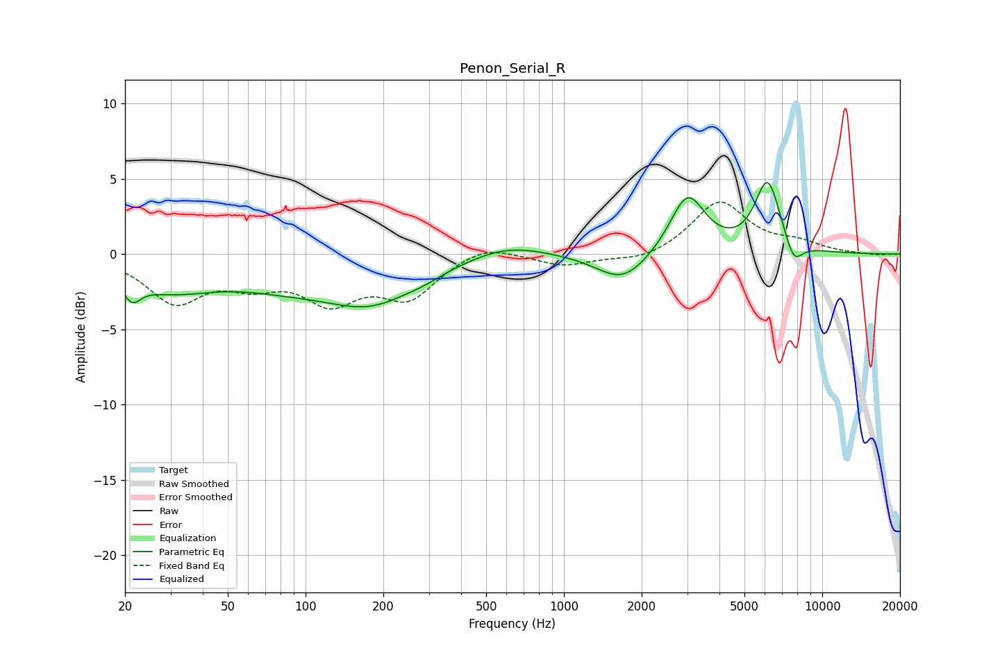

# Penon_Serial_R
See [usage instructions](https://github.com/jaakkopasanen/AutoEq#usage) for more options and info.

### Parametric EQs
Apply preamp of -4.9 dB when using parametric equalizer.

|   # | Type    |   Fc (Hz) |    Q |   Gain (dB) |
|-----|---------|-----------|------|-------------|
|   1 | Peaking |        21 | 4.31 |        -1.3 |
|   2 | Peaking |        29 | 0.75 |        -2.1 |
|   3 | Peaking |        84 | 0.66 |        -1.4 |
|   4 | Peaking |       180 | 0.8  |        -2.7 |
|   5 | Peaking |       291 | 1.79 |        -0.3 |
|   6 | Peaking |       607 | 0.98 |         0.8 |
|   7 | Peaking |      1691 | 1.4  |        -2   |
|   8 | Peaking |      3009 | 2.07 |         4   |
|   9 | Peaking |      6149 | 2.76 |         4.8 |
|  10 | Peaking |      7757 | 3.94 |        -1.6 |

### Fixed Band EQs
When using fixed band (also called graphic) equalizer, apply preamp of **-3.6 dB** (if available) and set gains manually with these parameters.

|   # | Type    |   Fc (Hz) |    Q |   Gain (dB) |
|-----|---------|-----------|------|-------------|
|   1 | Peaking |        31 | 1.41 |        -3   |
|   2 | Peaking |        62 | 1.41 |        -1.5 |
|   3 | Peaking |       125 | 1.41 |        -2.8 |
|   4 | Peaking |       250 | 1.41 |        -2.7 |
|   5 | Peaking |       500 | 1.41 |         0.8 |
|   6 | Peaking |      1000 | 1.41 |        -0.8 |
|   7 | Peaking |      2000 | 1.41 |        -0.5 |
|   8 | Peaking |      4000 | 1.41 |         3.5 |
|   9 | Peaking |      8000 | 1.41 |         0.6 |
|  10 | Peaking |     16000 | 1.41 |        -0.1 |

### Graphs

