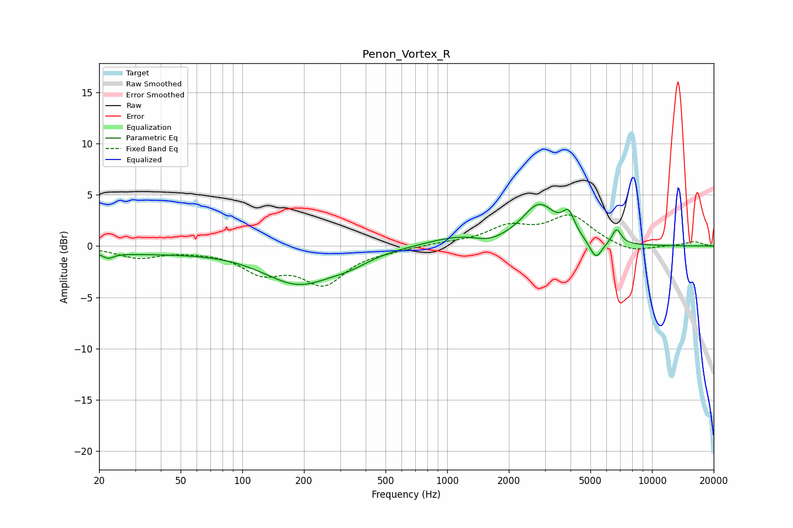

# Penon_Vortex_R
See [usage instructions](https://github.com/jaakkopasanen/AutoEq#usage) for more options and info.

### Parametric EQs
Apply preamp of -4.2 dB when using parametric equalizer.

|   # | Type    |   Fc (Hz) |    Q |   Gain (dB) |
|-----|---------|-----------|------|-------------|
|   1 | Peaking |        22 | 5.99 |        -0.5 |
|   2 | Peaking |        28 | 0.38 |        -0.7 |
|   3 | Peaking |       189 | 0.81 |        -3.5 |
|   4 | Peaking |       335 | 1.5  |        -0.7 |
|   5 | Peaking |      1223 | 0.86 |         1.1 |
|   6 | Peaking |      1585 | 1.75 |        -0.8 |
|   7 | Peaking |      2818 | 1.73 |         3.8 |
|   8 | Peaking |      3912 | 4.85 |         2   |
|   9 | Peaking |      5321 | 4.61 |        -1.8 |
|  10 | Peaking |      6714 | 6    |         1.5 |

### Fixed Band EQs
When using fixed band (also called graphic) equalizer, apply preamp of **-3.1 dB** (if available) and set gains manually with these parameters.

|   # | Type    |   Fc (Hz) |    Q |   Gain (dB) |
|-----|---------|-----------|------|-------------|
|   1 | Peaking |        31 | 1.41 |        -1.1 |
|   2 | Peaking |        62 | 1.41 |        -0.2 |
|   3 | Peaking |       125 | 1.41 |        -2.3 |
|   4 | Peaking |       250 | 1.41 |        -3.4 |
|   5 | Peaking |       500 | 1.41 |        -0.3 |
|   6 | Peaking |      1000 | 1.41 |         0.2 |
|   7 | Peaking |      2000 | 1.41 |         1.7 |
|   8 | Peaking |      4000 | 1.41 |         2.8 |
|   9 | Peaking |      8000 | 1.41 |        -0.7 |
|  10 | Peaking |     16000 | 1.41 |         0.4 |

### Graphs

