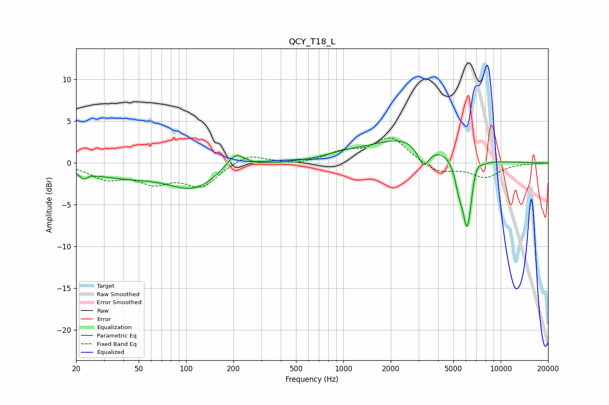

# QCY_T18_L
See [usage instructions](https://github.com/jaakkopasanen/AutoEq#usage) for more options and info.

### Parametric EQs
Apply preamp of -2.7 dB when using parametric equalizer.

|   # | Type    |   Fc (Hz) |    Q |   Gain (dB) |
|-----|---------|-----------|------|-------------|
|   1 | Peaking |        22 | 5.93 |        -0.7 |
|   2 | Peaking |        39 | 0.55 |        -1.5 |
|   3 | Peaking |       111 | 0.94 |        -2.7 |
|   4 | Peaking |       206 | 2.37 |         2   |
|   5 | Peaking |      1009 | 1.24 |         0.5 |
|   6 | Peaking |      2567 | 0.58 |         3   |
|   7 | Peaking |      3228 | 3.65 |        -2.7 |
|   8 | Peaking |      5418 | 5.94 |        -2.2 |
|   9 | Peaking |      6120 | 4.47 |        -8.4 |
|  10 | Peaking |      6985 | 5.3  |         1.2 |

### Fixed Band EQs
When using fixed band (also called graphic) equalizer, apply preamp of **-3.1 dB** (if available) and set gains manually with these parameters.

|   # | Type    |   Fc (Hz) |    Q |   Gain (dB) |
|-----|---------|-----------|------|-------------|
|   1 | Peaking |        31 | 1.41 |        -1.7 |
|   2 | Peaking |        62 | 1.41 |        -2   |
|   3 | Peaking |       125 | 1.41 |        -2.7 |
|   4 | Peaking |       250 | 1.41 |         1.2 |
|   5 | Peaking |       500 | 1.41 |        -0.3 |
|   6 | Peaking |      1000 | 1.41 |         1.2 |
|   7 | Peaking |      2000 | 1.41 |         3   |
|   8 | Peaking |      4000 | 1.41 |        -1.2 |
|   9 | Peaking |      8000 | 1.41 |        -1.7 |
|  10 | Peaking |     16000 | 1.41 |        -0   |

### Graphs

