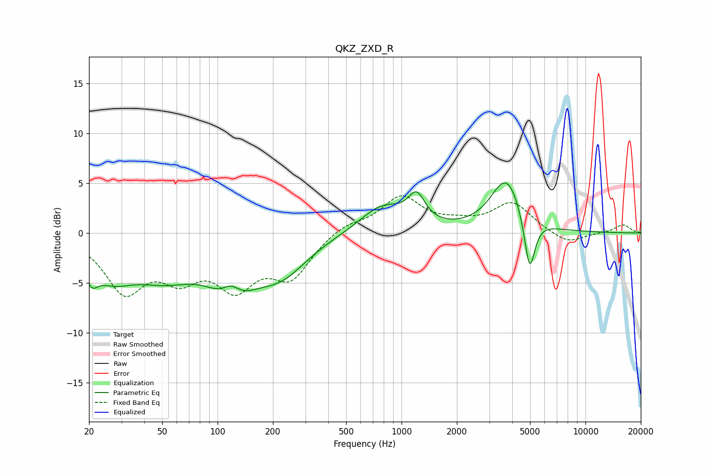

# QKZ_ZXD_R
See [usage instructions](https://github.com/jaakkopasanen/AutoEq#usage) for more options and info.

### Parametric EQs
Apply preamp of -5.1 dB when using parametric equalizer.

|   # | Type    |   Fc (Hz) |    Q |   Gain (dB) |
|-----|---------|-----------|------|-------------|
|   1 | Peaking |        21 | 4.19 |        -2   |
|   2 | Peaking |        26 | 1.16 |        -3.2 |
|   3 | Peaking |        52 | 0.76 |        -3.5 |
|   4 | Peaking |       119 | 2.43 |         2.7 |
|   5 | Peaking |       119 | 1.3  |        -5.5 |
|   6 | Peaking |       221 | 0.96 |        -3.5 |
|   7 | Peaking |       788 | 1.14 |         2.8 |
|   8 | Peaking |      1210 | 3.13 |         2.7 |
|   9 | Peaking |      3719 | 1.67 |         5.5 |
|  10 | Peaking |      4974 | 4.81 |        -5.7 |

### Fixed Band EQs
When using fixed band (also called graphic) equalizer, apply preamp of **-3.8 dB** (if available) and set gains manually with these parameters.

|   # | Type    |   Fc (Hz) |    Q |   Gain (dB) |
|-----|---------|-----------|------|-------------|
|   1 | Peaking |        31 | 1.41 |        -5.5 |
|   2 | Peaking |        62 | 1.41 |        -3.5 |
|   3 | Peaking |       125 | 1.41 |        -4.7 |
|   4 | Peaking |       250 | 1.41 |        -4.1 |
|   5 | Peaking |       500 | 1.41 |         1   |
|   6 | Peaking |      1000 | 1.41 |         3.5 |
|   7 | Peaking |      2000 | 1.41 |         0.7 |
|   8 | Peaking |      4000 | 1.41 |         3   |
|   9 | Peaking |      8000 | 1.41 |        -1.2 |
|  10 | Peaking |     16000 | 1.41 |         0.8 |

### Graphs

