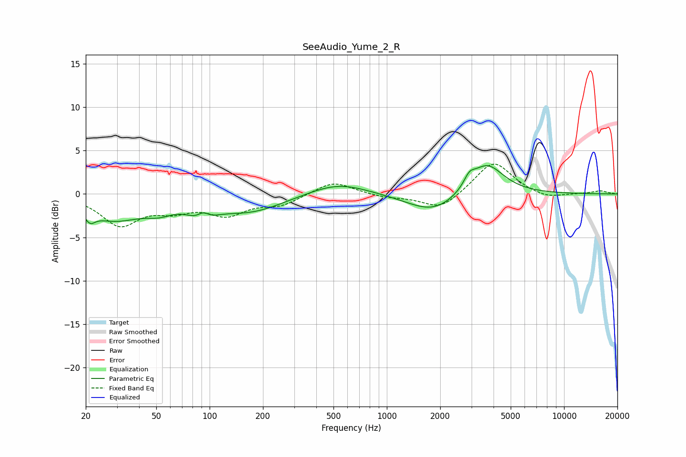

# SeeAudio_Yume_2_R
See [usage instructions](https://github.com/jaakkopasanen/AutoEq#usage) for more options and info.

### Parametric EQs
Apply preamp of -3.4 dB when using parametric equalizer.

|   # | Type    |   Fc (Hz) |    Q |   Gain (dB) |
|-----|---------|-----------|------|-------------|
|   1 | Peaking |        21 | 5.2  |        -1.1 |
|   2 | Peaking |        29 | 0.84 |        -2.8 |
|   3 | Peaking |        52 | 1.94 |        -0.9 |
|   4 | Peaking |        91 | 2.19 |        -2.2 |
|   5 | Peaking |        92 | 3.87 |         1.5 |
|   6 | Peaking |       169 | 0.73 |        -2   |
|   7 | Peaking |       529 | 0.85 |         1.5 |
|   8 | Peaking |      1841 | 0.95 |        -2.3 |
|   9 | Peaking |      2920 | 4.63 |         1.1 |
|  10 | Peaking |      3641 | 1.44 |         3.8 |

### Fixed Band EQs
When using fixed band (also called graphic) equalizer, apply preamp of **-3.5 dB** (if available) and set gains manually with these parameters.

|   # | Type    |   Fc (Hz) |    Q |   Gain (dB) |
|-----|---------|-----------|------|-------------|
|   1 | Peaking |        31 | 1.41 |        -3.4 |
|   2 | Peaking |        62 | 1.41 |        -1.5 |
|   3 | Peaking |       125 | 1.41 |        -2.1 |
|   4 | Peaking |       250 | 1.41 |        -1.2 |
|   5 | Peaking |       500 | 1.41 |         1.5 |
|   6 | Peaking |      1000 | 1.41 |        -0.4 |
|   7 | Peaking |      2000 | 1.41 |        -1.8 |
|   8 | Peaking |      4000 | 1.41 |         3.8 |
|   9 | Peaking |      8000 | 1.41 |        -0.6 |
|  10 | Peaking |     16000 | 1.41 |         0.4 |

### Graphs

