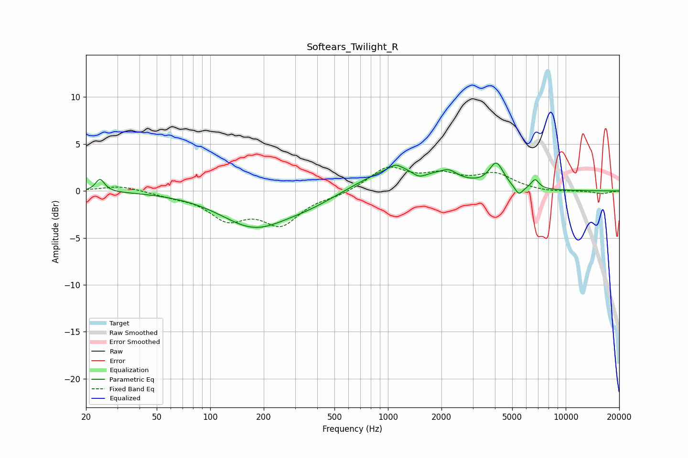

# Softears_Twilight_R
See [usage instructions](https://github.com/jaakkopasanen/AutoEq#usage) for more options and info.

### Parametric EQs
Apply preamp of -3.1 dB when using parametric equalizer.

|   # | Type    |   Fc (Hz) |    Q |   Gain (dB) |
|-----|---------|-----------|------|-------------|
|   1 | Peaking |        24 | 5.71 |         1.4 |
|   2 | Peaking |       176 | 0.75 |        -3.6 |
|   3 | Peaking |       370 | 0.83 |        -1   |
|   4 | Peaking |      1102 | 4.64 |         0.5 |
|   5 | Peaking |      1178 | 0.66 |         2.8 |
|   6 | Peaking |      1493 | 3.24 |        -0.9 |
|   7 | Peaking |      2200 | 3.21 |         0.8 |
|   8 | Peaking |      4072 | 3.56 |         2.5 |
|   9 | Peaking |      5451 | 5.77 |        -1   |
|  10 | Peaking |      6727 | 6    |         1   |

### Fixed Band EQs
When using fixed band (also called graphic) equalizer, apply preamp of **-2.6 dB** (if available) and set gains manually with these parameters.

|   # | Type    |   Fc (Hz) |    Q |   Gain (dB) |
|-----|---------|-----------|------|-------------|
|   1 | Peaking |        31 | 1.41 |         0.6 |
|   2 | Peaking |        62 | 1.41 |        -0.4 |
|   3 | Peaking |       125 | 1.41 |        -2.7 |
|   4 | Peaking |       250 | 1.41 |        -3.3 |
|   5 | Peaking |       500 | 1.41 |        -0.4 |
|   6 | Peaking |      1000 | 1.41 |         2.4 |
|   7 | Peaking |      2000 | 1.41 |         1.4 |
|   8 | Peaking |      4000 | 1.41 |         1.7 |
|   9 | Peaking |      8000 | 1.41 |        -0.2 |
|  10 | Peaking |     16000 | 1.41 |        -0.3 |

### Graphs

