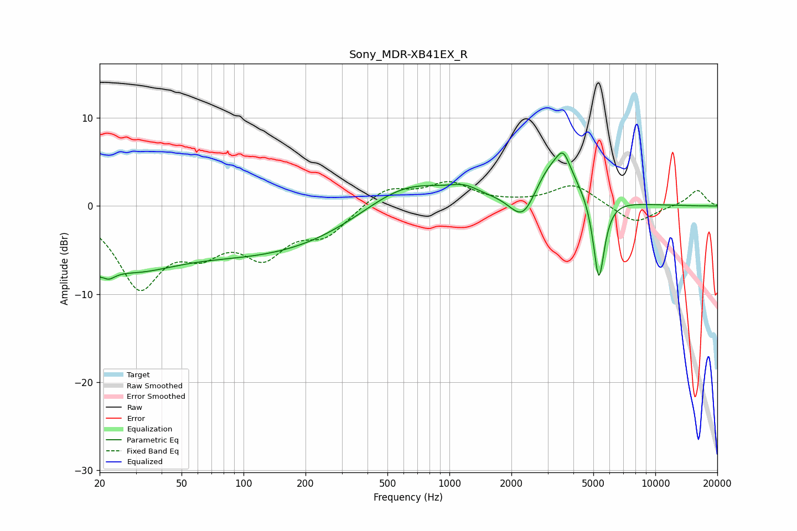

# Sony_MDR-XB41EX_R
See [usage instructions](https://github.com/jaakkopasanen/AutoEq#usage) for more options and info.

### Parametric EQs
Apply preamp of -6.1 dB when using parametric equalizer.

|   # | Type    |   Fc (Hz) |    Q |   Gain (dB) |
|-----|---------|-----------|------|-------------|
|   1 | Peaking |        21 | 4.04 |        -5.7 |
|   2 | Peaking |        21 | 5.65 |         3.3 |
|   3 | Peaking |        28 | 0.62 |        -5.4 |
|   4 | Peaking |       133 | 0.31 |        -5.1 |
|   5 | Peaking |       607 | 0.66 |         3.6 |
|   6 | Peaking |      1180 | 2.04 |         0.9 |
|   7 | Peaking |      2290 | 2.1  |        -4.2 |
|   8 | Peaking |      3214 | 1.2  |         5.6 |
|   9 | Peaking |      3572 | 4.6  |         2   |
|  10 | Peaking |      5317 | 4.98 |        -9.9 |

### Fixed Band EQs
When using fixed band (also called graphic) equalizer, apply preamp of **-2.9 dB** (if available) and set gains manually with these parameters.

|   # | Type    |   Fc (Hz) |    Q |   Gain (dB) |
|-----|---------|-----------|------|-------------|
|   1 | Peaking |        31 | 1.41 |        -8.7 |
|   2 | Peaking |        62 | 1.41 |        -3.8 |
|   3 | Peaking |       125 | 1.41 |        -4.9 |
|   4 | Peaking |       250 | 1.41 |        -3   |
|   5 | Peaking |       500 | 1.41 |         2.1 |
|   6 | Peaking |      1000 | 1.41 |         2.4 |
|   7 | Peaking |      2000 | 1.41 |         0.2 |
|   8 | Peaking |      4000 | 1.41 |         2.4 |
|   9 | Peaking |      8000 | 1.41 |        -2.1 |
|  10 | Peaking |     16000 | 1.41 |         1.8 |

### Graphs

