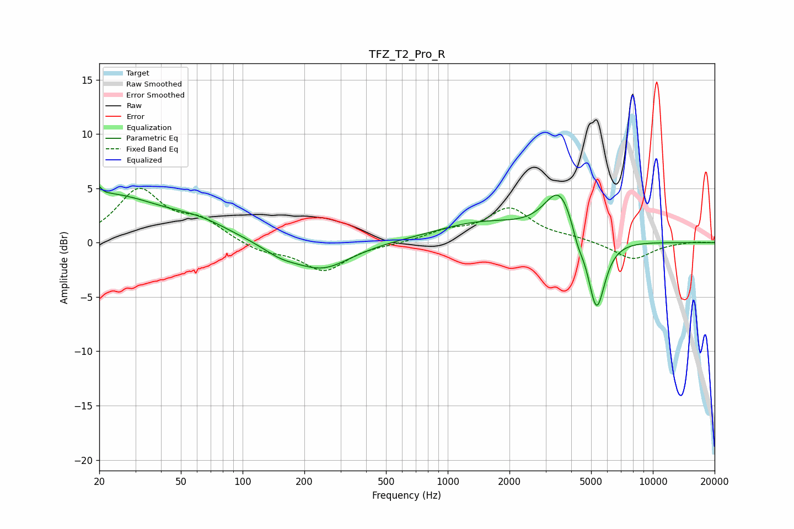

# TFZ_T2_Pro_R
See [usage instructions](https://github.com/jaakkopasanen/AutoEq#usage) for more options and info.

### Parametric EQs
Apply preamp of -5.3 dB when using parametric equalizer.

|   # | Type    |   Fc (Hz) |    Q |   Gain (dB) |
|-----|---------|-----------|------|-------------|
|   1 | Peaking |        20 | 5.8  |         3.3 |
|   2 | Peaking |        20 | 5.94 |        -2.5 |
|   3 | Peaking |        22 | 0.53 |         4.2 |
|   4 | Peaking |        62 | 0.97 |         1.1 |
|   5 | Peaking |       152 | 1.62 |        -0.8 |
|   6 | Peaking |       244 | 1.01 |        -2.4 |
|   7 | Peaking |      1468 | 0.61 |         1.8 |
|   8 | Peaking |      3518 | 1.87 |         4.6 |
|   9 | Peaking |      4310 | 4.9  |        -1.3 |
|  10 | Peaking |      5310 | 3.28 |        -7.1 |

### Fixed Band EQs
When using fixed band (also called graphic) equalizer, apply preamp of **-5.1 dB** (if available) and set gains manually with these parameters.

|   # | Type    |   Fc (Hz) |    Q |   Gain (dB) |
|-----|---------|-----------|------|-------------|
|   1 | Peaking |        31 | 1.41 |         4.7 |
|   2 | Peaking |        62 | 1.41 |         1.8 |
|   3 | Peaking |       125 | 1.41 |        -0.8 |
|   4 | Peaking |       250 | 1.41 |        -2.6 |
|   5 | Peaking |       500 | 1.41 |        -0.1 |
|   6 | Peaking |      1000 | 1.41 |         0.9 |
|   7 | Peaking |      2000 | 1.41 |         3   |
|   8 | Peaking |      4000 | 1.41 |         0.4 |
|   9 | Peaking |      8000 | 1.41 |        -1.6 |
|  10 | Peaking |     16000 | 1.41 |         0.1 |

### Graphs

