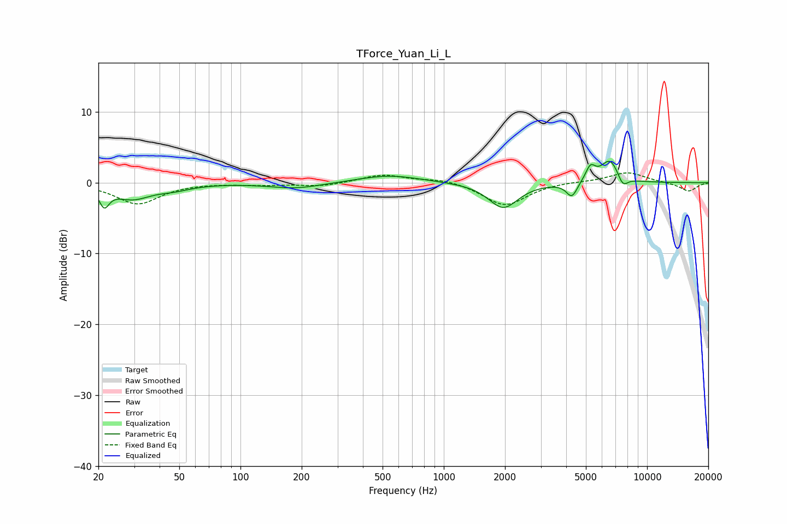

# TForce_Yuan_Li_L
See [usage instructions](https://github.com/jaakkopasanen/AutoEq#usage) for more options and info.

### Parametric EQs
Apply preamp of -3.1 dB when using parametric equalizer.

|   # | Type    |   Fc (Hz) |    Q |   Gain (dB) |
|-----|---------|-----------|------|-------------|
|   1 | Peaking |        21 | 5.91 |        -2.5 |
|   2 | Peaking |        29 | 1.57 |        -2.1 |
|   3 | Peaking |        47 | 1.63 |        -0.7 |
|   4 | Peaking |       188 | 1.1  |        -0.8 |
|   5 | Peaking |       538 | 0.93 |         1.1 |
|   6 | Peaking |      1962 | 1.96 |        -3.6 |
|   7 | Peaking |      4267 | 5.15 |        -2.1 |
|   8 | Peaking |      5263 | 5.71 |         2   |
|   9 | Peaking |      6575 | 2.94 |         3.3 |
|  10 | Peaking |      7589 | 5.18 |        -1.7 |

### Fixed Band EQs
When using fixed band (also called graphic) equalizer, apply preamp of **-1.5 dB** (if available) and set gains manually with these parameters.

|   # | Type    |   Fc (Hz) |    Q |   Gain (dB) |
|-----|---------|-----------|------|-------------|
|   1 | Peaking |        31 | 1.41 |        -3   |
|   2 | Peaking |        62 | 1.41 |         0   |
|   3 | Peaking |       125 | 1.41 |        -0.3 |
|   4 | Peaking |       250 | 1.41 |        -0.5 |
|   5 | Peaking |       500 | 1.41 |         1.2 |
|   6 | Peaking |      1000 | 1.41 |         0.6 |
|   7 | Peaking |      2000 | 1.41 |        -3.3 |
|   8 | Peaking |      4000 | 1.41 |         0.2 |
|   9 | Peaking |      8000 | 1.41 |         1.5 |
|  10 | Peaking |     16000 | 1.41 |        -1.2 |

### Graphs

