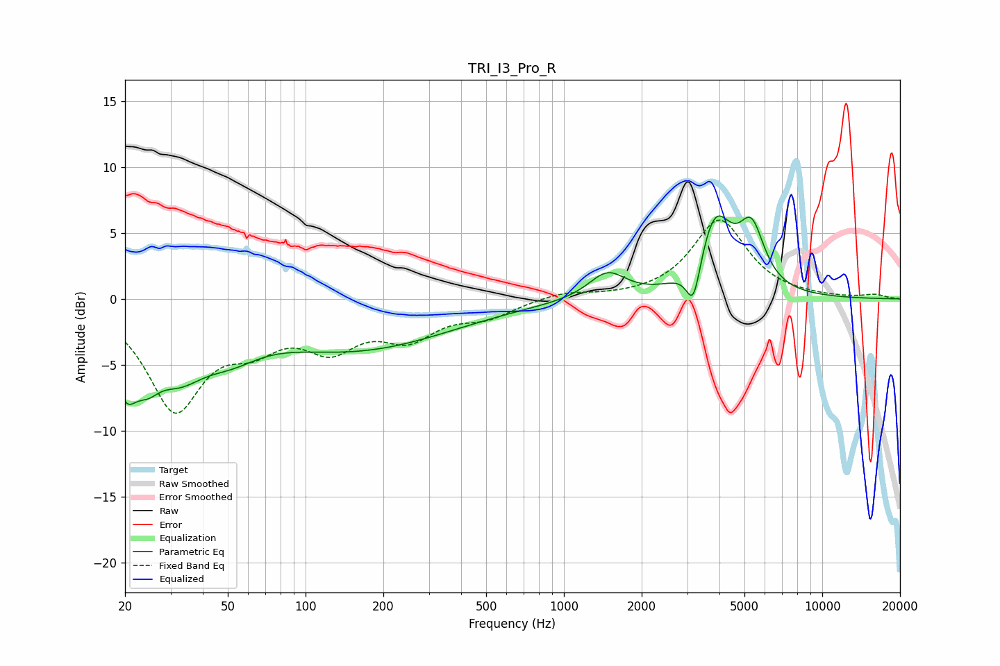

# TRI_I3_Pro_R
See [usage instructions](https://github.com/jaakkopasanen/AutoEq#usage) for more options and info.

### Parametric EQs
Apply preamp of -6.4 dB when using parametric equalizer.

|   # | Type    |   Fc (Hz) |    Q |   Gain (dB) |
|-----|---------|-----------|------|-------------|
|   1 | Peaking |        20 | 2.99 |        -4.9 |
|   2 | Peaking |        24 | 2.81 |        -2.2 |
|   3 | Peaking |        32 | 1.32 |        -4.2 |
|   4 | Peaking |        50 | 0.56 |         2.2 |
|   5 | Peaking |        51 | 1.08 |        -2.8 |
|   6 | Peaking |       127 | 0.33 |        -4.3 |
|   7 | Peaking |      1472 | 1.96 |         2   |
|   8 | Peaking |      3175 | 5.08 |        -3.4 |
|   9 | Peaking |      3849 | 2.15 |         5.8 |
|  10 | Peaking |      5328 | 2.82 |         4.4 |

### Fixed Band EQs
When using fixed band (also called graphic) equalizer, apply preamp of **-6.1 dB** (if available) and set gains manually with these parameters.

|   # | Type    |   Fc (Hz) |    Q |   Gain (dB) |
|-----|---------|-----------|------|-------------|
|   1 | Peaking |        31 | 1.41 |        -8.1 |
|   2 | Peaking |        62 | 1.41 |        -2.5 |
|   3 | Peaking |       125 | 1.41 |        -3.1 |
|   4 | Peaking |       250 | 1.41 |        -2.6 |
|   5 | Peaking |       500 | 1.41 |        -1.2 |
|   6 | Peaking |      1000 | 1.41 |         0.5 |
|   7 | Peaking |      2000 | 1.41 |         0   |
|   8 | Peaking |      4000 | 1.41 |         6   |
|   9 | Peaking |      8000 | 1.41 |         0.1 |
|  10 | Peaking |     16000 | 1.41 |         0.3 |

### Graphs

