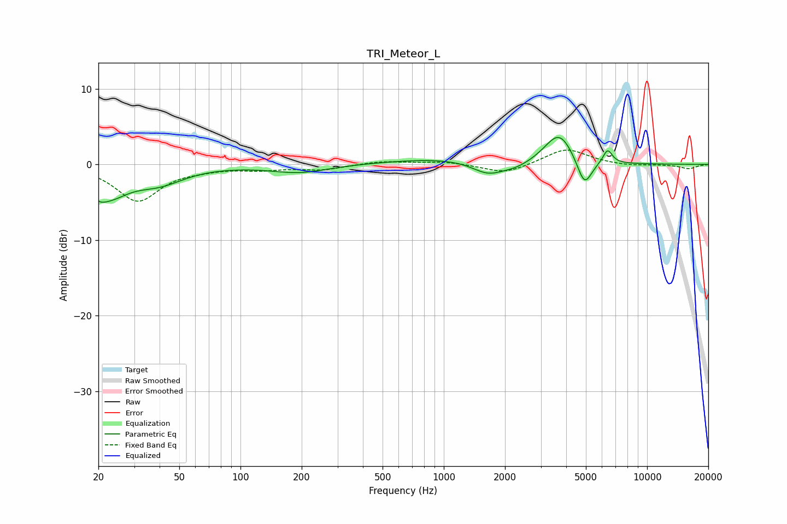

# TRI_Meteor_L
See [usage instructions](https://github.com/jaakkopasanen/AutoEq#usage) for more options and info.

### Parametric EQs
Apply preamp of -3.7 dB when using parametric equalizer.

|   # | Type    |   Fc (Hz) |    Q |   Gain (dB) |
|-----|---------|-----------|------|-------------|
|   1 | Peaking |        20 | 3.83 |        -1.4 |
|   2 | Peaking |        23 | 1.53 |        -3.3 |
|   3 | Peaking |        39 | 1.1  |        -2.2 |
|   4 | Peaking |       195 | 1    |        -1.1 |
|   5 | Peaking |      1006 | 0.53 |         0.8 |
|   6 | Peaking |      1648 | 1.8  |        -1.7 |
|   7 | Peaking |      2266 | 1.83 |        -0.8 |
|   8 | Peaking |      3695 | 1.99 |         4.3 |
|   9 | Peaking |      4919 | 3.74 |        -3.8 |
|  10 | Peaking |      6395 | 6    |         1.9 |

### Fixed Band EQs
When using fixed band (also called graphic) equalizer, apply preamp of **-2.0 dB** (if available) and set gains manually with these parameters.

|   # | Type    |   Fc (Hz) |    Q |   Gain (dB) |
|-----|---------|-----------|------|-------------|
|   1 | Peaking |        31 | 1.41 |        -4.8 |
|   2 | Peaking |        62 | 1.41 |        -0.4 |
|   3 | Peaking |       125 | 1.41 |        -0.6 |
|   4 | Peaking |       250 | 1.41 |        -0.7 |
|   5 | Peaking |       500 | 1.41 |         0.4 |
|   6 | Peaking |      1000 | 1.41 |         0.4 |
|   7 | Peaking |      2000 | 1.41 |        -1.3 |
|   8 | Peaking |      4000 | 1.41 |         2.1 |
|   9 | Peaking |      8000 | 1.41 |        -0.2 |
|  10 | Peaking |     16000 | 1.41 |        -0.6 |

### Graphs

