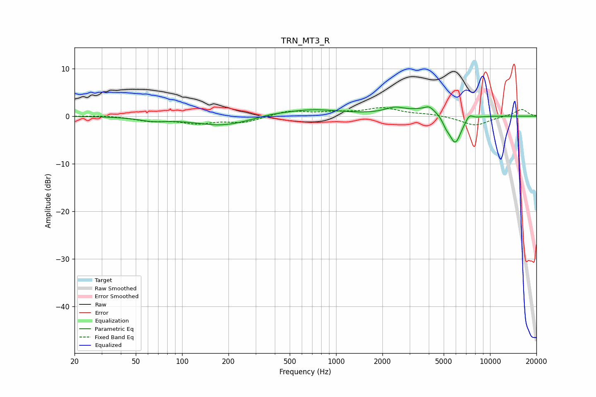

# TRN_MT3_R
See [usage instructions](https://github.com/jaakkopasanen/AutoEq#usage) for more options and info.

### Parametric EQs
Apply preamp of -2.1 dB when using parametric equalizer.

|   # | Type    |   Fc (Hz) |    Q |   Gain (dB) |
|-----|---------|-----------|------|-------------|
|   1 | Peaking |        65 | 1.48 |        -0.8 |
|   2 | Peaking |       181 | 0.79 |        -2   |
|   3 | Peaking |       369 | 1.81 |         0.3 |
|   4 | Peaking |       680 | 0.72 |         1.5 |
|   5 | Peaking |      2394 | 2.19 |         1.2 |
|   6 | Peaking |      4017 | 5.48 |         0.8 |
|   7 | Peaking |      4150 | 1.14 |         1.8 |
|   8 | Peaking |      5166 | 5.98 |        -1.2 |
|   9 | Peaking |      5932 | 3.27 |        -6.4 |
|  10 | Peaking |      7330 | 5.97 |         1.2 |

### Fixed Band EQs
When using fixed band (also called graphic) equalizer, apply preamp of **-1.9 dB** (if available) and set gains manually with these parameters.

|   # | Type    |   Fc (Hz) |    Q |   Gain (dB) |
|-----|---------|-----------|------|-------------|
|   1 | Peaking |        31 | 1.41 |         0.2 |
|   2 | Peaking |        62 | 1.41 |        -0.9 |
|   3 | Peaking |       125 | 1.41 |        -1.3 |
|   4 | Peaking |       250 | 1.41 |        -1.3 |
|   5 | Peaking |       500 | 1.41 |         1.1 |
|   6 | Peaking |      1000 | 1.41 |         0.6 |
|   7 | Peaking |      2000 | 1.41 |         1.6 |
|   8 | Peaking |      4000 | 1.41 |         0.4 |
|   9 | Peaking |      8000 | 1.41 |        -2   |
|  10 | Peaking |     16000 | 1.41 |         1.5 |

### Graphs

