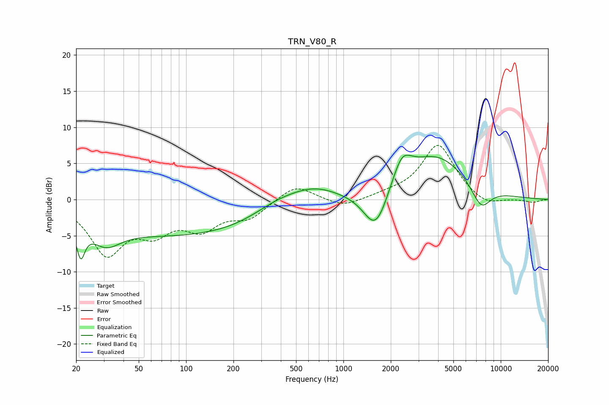

# TRN_V80_R
See [usage instructions](https://github.com/jaakkopasanen/AutoEq#usage) for more options and info.

### Parametric EQs
Apply preamp of -6.2 dB when using parametric equalizer.

|   # | Type    |   Fc (Hz) |    Q |   Gain (dB) |
|-----|---------|-----------|------|-------------|
|   1 | Peaking |        21 | 5.45 |        -4.2 |
|   2 | Peaking |        31 | 1.59 |        -2.6 |
|   3 | Peaking |       104 | 0.18 |        -5.1 |
|   4 | Peaking |       374 | 0.82 |         2.1 |
|   5 | Peaking |       643 | 0.83 |         2.6 |
|   6 | Peaking |      1600 | 1.95 |        -1.5 |
|   7 | Peaking |      1609 | 1.81 |        -4.3 |
|   8 | Peaking |      2355 | 2.26 |         3.9 |
|   9 | Peaking |      3904 | 0.71 |         5.9 |
|  10 | Peaking |      7495 | 2.18 |        -3.3 |

### Fixed Band EQs
When using fixed band (also called graphic) equalizer, apply preamp of **-7.6 dB** (if available) and set gains manually with these parameters.

|   # | Type    |   Fc (Hz) |    Q |   Gain (dB) |
|-----|---------|-----------|------|-------------|
|   1 | Peaking |        31 | 1.41 |        -7.2 |
|   2 | Peaking |        62 | 1.41 |        -3.6 |
|   3 | Peaking |       125 | 1.41 |        -3.5 |
|   4 | Peaking |       250 | 1.41 |        -2.3 |
|   5 | Peaking |       500 | 1.41 |         2.2 |
|   6 | Peaking |      1000 | 1.41 |        -1.2 |
|   7 | Peaking |      2000 | 1.41 |         0.5 |
|   8 | Peaking |      4000 | 1.41 |         7.6 |
|   9 | Peaking |      8000 | 1.41 |        -1.2 |
|  10 | Peaking |     16000 | 1.41 |        -0.4 |

### Graphs

