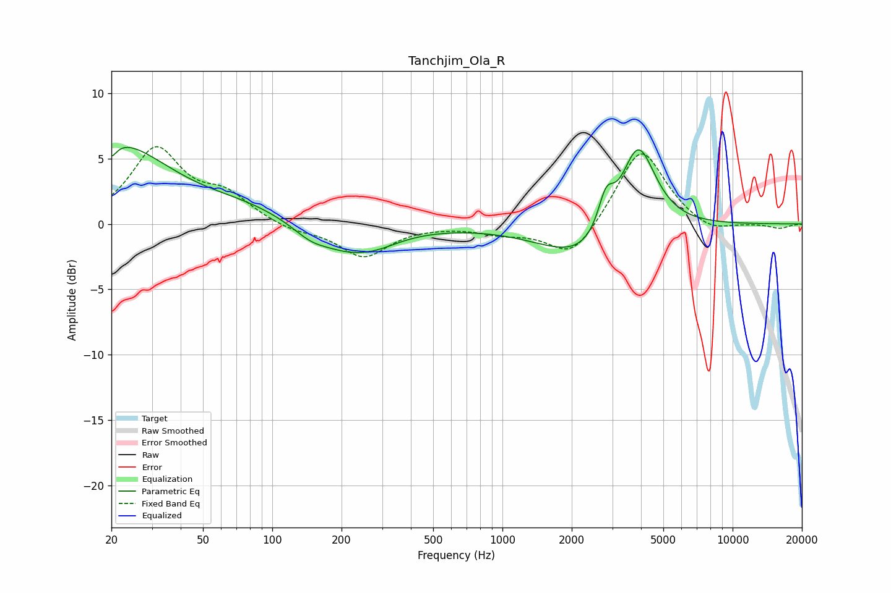

# Tanchjim_Ola_R
See [usage instructions](https://github.com/jaakkopasanen/AutoEq#usage) for more options and info.

### Parametric EQs
Apply preamp of -6.0 dB when using parametric equalizer.

|   # | Type    |   Fc (Hz) |    Q |   Gain (dB) |
|-----|---------|-----------|------|-------------|
|   1 | Peaking |        20 | 5.92 |         4.2 |
|   2 | Peaking |        20 | 0.59 |         6.2 |
|   3 | Peaking |        20 | 5.88 |        -5.3 |
|   4 | Peaking |        78 | 0.71 |         1   |
|   5 | Peaking |       146 | 1.92 |        -0.7 |
|   6 | Peaking |       220 | 0.88 |        -2.2 |
|   7 | Peaking |       292 | 1.58 |        -0.3 |
|   8 | Peaking |      2365 | 0.75 |        -3.1 |
|   9 | Peaking |      2818 | 4.06 |         2.7 |
|  10 | Peaking |      3876 | 1.79 |         7.2 |

### Fixed Band EQs
When using fixed band (also called graphic) equalizer, apply preamp of **-6.0 dB** (if available) and set gains manually with these parameters.

|   # | Type    |   Fc (Hz) |    Q |   Gain (dB) |
|-----|---------|-----------|------|-------------|
|   1 | Peaking |        31 | 1.41 |         5.6 |
|   2 | Peaking |        62 | 1.41 |         1.9 |
|   3 | Peaking |       125 | 1.41 |        -0.5 |
|   4 | Peaking |       250 | 1.41 |        -2.5 |
|   5 | Peaking |       500 | 1.41 |        -0   |
|   6 | Peaking |      1000 | 1.41 |        -0.6 |
|   7 | Peaking |      2000 | 1.41 |        -2.7 |
|   8 | Peaking |      4000 | 1.41 |         6   |
|   9 | Peaking |      8000 | 1.41 |        -0.8 |
|  10 | Peaking |     16000 | 1.41 |        -0.3 |

### Graphs

