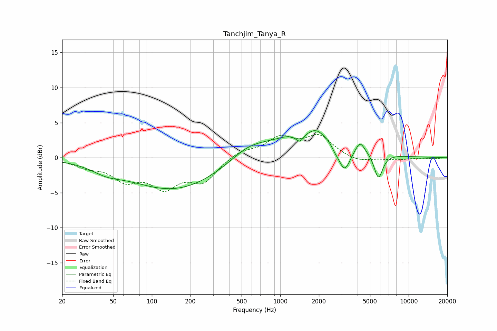

# Tanchjim_Tanya_R
See [usage instructions](https://github.com/jaakkopasanen/AutoEq#usage) for more options and info.

### Parametric EQs
Apply preamp of -4.0 dB when using parametric equalizer.

|   # | Type    |   Fc (Hz) |    Q |   Gain (dB) |
|-----|---------|-----------|------|-------------|
|   1 | Peaking |        44 | 1.24 |        -1   |
|   2 | Peaking |       150 | 0.4  |        -4.6 |
|   3 | Peaking |       563 | 0.99 |         1.8 |
|   4 | Peaking |      1419 | 4.35 |        -1.3 |
|   5 | Peaking |      1736 | 0.52 |         3.9 |
|   6 | Peaking |      1899 | 3.06 |         0.6 |
|   7 | Peaking |      2663 | 4.68 |        -0.7 |
|   8 | Peaking |      3163 | 2.91 |        -4.1 |
|   9 | Peaking |      4182 | 4.13 |         1.6 |
|  10 | Peaking |      5813 | 4    |        -3.7 |

### Fixed Band EQs
When using fixed band (also called graphic) equalizer, apply preamp of **-3.4 dB** (if available) and set gains manually with these parameters.

|   # | Type    |   Fc (Hz) |    Q |   Gain (dB) |
|-----|---------|-----------|------|-------------|
|   1 | Peaking |        31 | 1.41 |        -1.1 |
|   2 | Peaking |        62 | 1.41 |        -2.8 |
|   3 | Peaking |       125 | 1.41 |        -3.7 |
|   4 | Peaking |       250 | 1.41 |        -3.2 |
|   5 | Peaking |       500 | 1.41 |         1   |
|   6 | Peaking |      1000 | 1.41 |         2.6 |
|   7 | Peaking |      2000 | 1.41 |         2.9 |
|   8 | Peaking |      4000 | 1.41 |        -0.7 |
|   9 | Peaking |      8000 | 1.41 |        -0.3 |
|  10 | Peaking |     16000 | 1.41 |        -0.1 |

### Graphs

