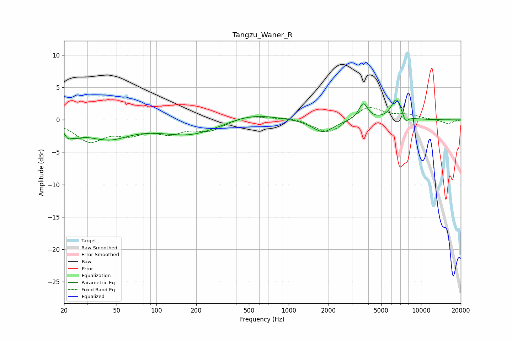

# Tangzu_Waner_R
See [usage instructions](https://github.com/jaakkopasanen/AutoEq#usage) for more options and info.

### Parametric EQs
Apply preamp of -3.2 dB when using parametric equalizer.

|   # | Type    |   Fc (Hz) |    Q |   Gain (dB) |
|-----|---------|-----------|------|-------------|
|   1 | Peaking |        21 | 5.88 |        -1.1 |
|   2 | Peaking |        25 | 3.47 |        -0.9 |
|   3 | Peaking |        38 | 1.88 |         0.3 |
|   4 | Peaking |        41 | 0.85 |        -3   |
|   5 | Peaking |       180 | 0.63 |        -2.3 |
|   6 | Peaking |       517 | 0.76 |         1.2 |
|   7 | Peaking |      1817 | 1.79 |        -2   |
|   8 | Peaking |      3664 | 4.15 |         2.6 |
|   9 | Peaking |      6518 | 3.49 |         3.3 |
|  10 | Peaking |      7624 | 5.8  |        -1.2 |

### Fixed Band EQs
When using fixed band (also called graphic) equalizer, apply preamp of **-2.0 dB** (if available) and set gains manually with these parameters.

|   # | Type    |   Fc (Hz) |    Q |   Gain (dB) |
|-----|---------|-----------|------|-------------|
|   1 | Peaking |        31 | 1.41 |        -3.1 |
|   2 | Peaking |        62 | 1.41 |        -1.8 |
|   3 | Peaking |       125 | 1.41 |        -1.7 |
|   4 | Peaking |       250 | 1.41 |        -1.5 |
|   5 | Peaking |       500 | 1.41 |         0.7 |
|   6 | Peaking |      1000 | 1.41 |         0.4 |
|   7 | Peaking |      2000 | 1.41 |        -2.2 |
|   8 | Peaking |      4000 | 1.41 |         2.2 |
|   9 | Peaking |      8000 | 1.41 |         0.7 |
|  10 | Peaking |     16000 | 1.41 |        -0.6 |

### Graphs

