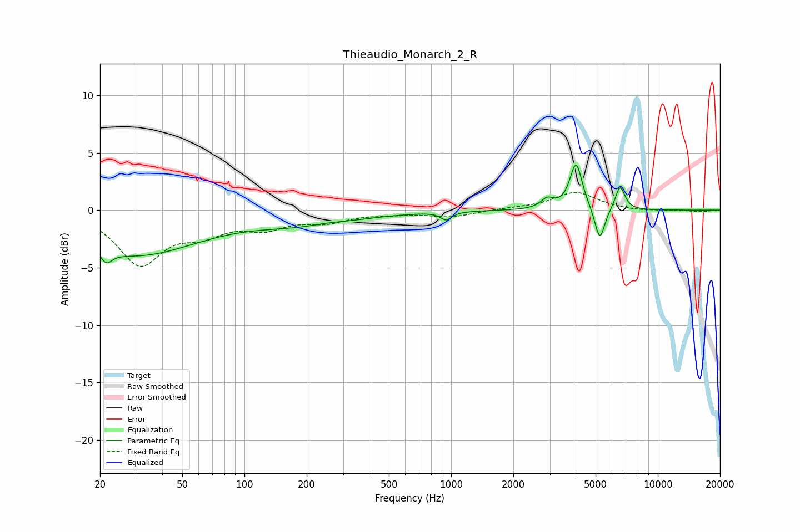

# Thieaudio_Monarch_2_R
See [usage instructions](https://github.com/jaakkopasanen/AutoEq#usage) for more options and info.

### Parametric EQs
Apply preamp of -4.0 dB when using parametric equalizer.

|   # | Type    |   Fc (Hz) |    Q |   Gain (dB) |
|-----|---------|-----------|------|-------------|
|   1 | Peaking |        22 | 5.78 |        -4.3 |
|   2 | Peaking |        22 | 5.93 |         3.2 |
|   3 | Peaking |        29 | 0.46 |        -3.8 |
|   4 | Peaking |       202 | 0.57 |        -1.2 |
|   5 | Peaking |       249 | 1.58 |         0.2 |
|   6 | Peaking |       946 | 5.44 |        -0.7 |
|   7 | Peaking |      2919 | 4.62 |         0.8 |
|   8 | Peaking |      4024 | 4.73 |         4.1 |
|   9 | Peaking |      5240 | 5.81 |        -2.9 |
|  10 | Peaking |      6571 | 6    |         2.1 |

### Fixed Band EQs
When using fixed band (also called graphic) equalizer, apply preamp of **-1.6 dB** (if available) and set gains manually with these parameters.

|   # | Type    |   Fc (Hz) |    Q |   Gain (dB) |
|-----|---------|-----------|------|-------------|
|   1 | Peaking |        31 | 1.41 |        -4.5 |
|   2 | Peaking |        62 | 1.41 |        -1.6 |
|   3 | Peaking |       125 | 1.41 |        -1.3 |
|   4 | Peaking |       250 | 1.41 |        -0.9 |
|   5 | Peaking |       500 | 1.41 |        -0.2 |
|   6 | Peaking |      1000 | 1.41 |        -0.6 |
|   7 | Peaking |      2000 | 1.41 |         0.1 |
|   8 | Peaking |      4000 | 1.41 |         1.6 |
|   9 | Peaking |      8000 | 1.41 |        -0.1 |
|  10 | Peaking |     16000 | 1.41 |        -0.1 |

### Graphs

