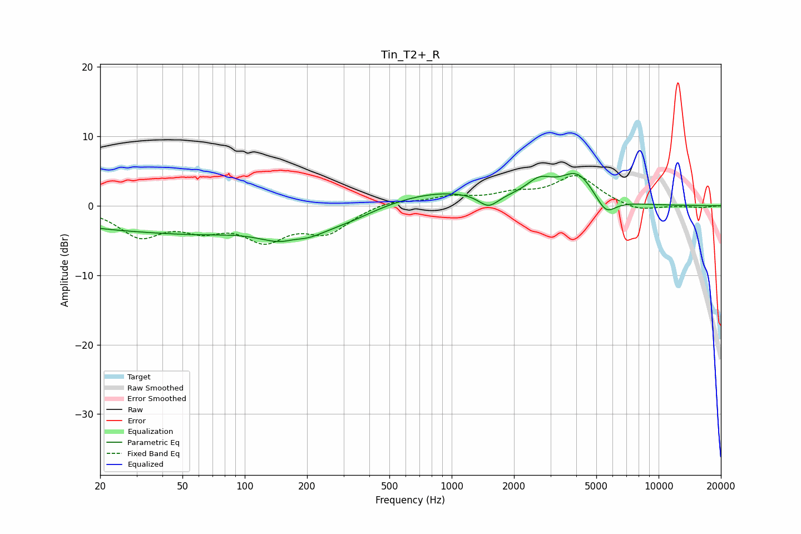

# Tin_T2+_R
See [usage instructions](https://github.com/jaakkopasanen/AutoEq#usage) for more options and info.

### Parametric EQs
Apply preamp of -4.7 dB when using parametric equalizer.

|   # | Type    |   Fc (Hz) |    Q |   Gain (dB) |
|-----|---------|-----------|------|-------------|
|   1 | Peaking |        28 | 0.32 |        -3.1 |
|   2 | Peaking |        69 | 0.63 |        -1.2 |
|   3 | Peaking |       170 | 1.03 |        -4.8 |
|   4 | Peaking |       172 | 2.28 |         1.2 |
|   5 | Peaking |       322 | 0.99 |        -1.3 |
|   6 | Peaking |       894 | 0.53 |         2.1 |
|   7 | Peaking |      1507 | 2.92 |        -1.9 |
|   8 | Peaking |      2656 | 2.19 |         2.4 |
|   9 | Peaking |      4042 | 1.68 |         4.3 |
|  10 | Peaking |      5556 | 2.88 |        -2.5 |

### Fixed Band EQs
When using fixed band (also called graphic) equalizer, apply preamp of **-4.4 dB** (if available) and set gains manually with these parameters.

|   # | Type    |   Fc (Hz) |    Q |   Gain (dB) |
|-----|---------|-----------|------|-------------|
|   1 | Peaking |        31 | 1.41 |        -4.1 |
|   2 | Peaking |        62 | 1.41 |        -2.6 |
|   3 | Peaking |       125 | 1.41 |        -4.3 |
|   4 | Peaking |       250 | 1.41 |        -3.5 |
|   5 | Peaking |       500 | 1.41 |         0.9 |
|   6 | Peaking |      1000 | 1.41 |         1.1 |
|   7 | Peaking |      2000 | 1.41 |         1.4 |
|   8 | Peaking |      4000 | 1.41 |         4.2 |
|   9 | Peaking |      8000 | 1.41 |        -0.9 |
|  10 | Peaking |     16000 | 1.41 |        -0.3 |

### Graphs

