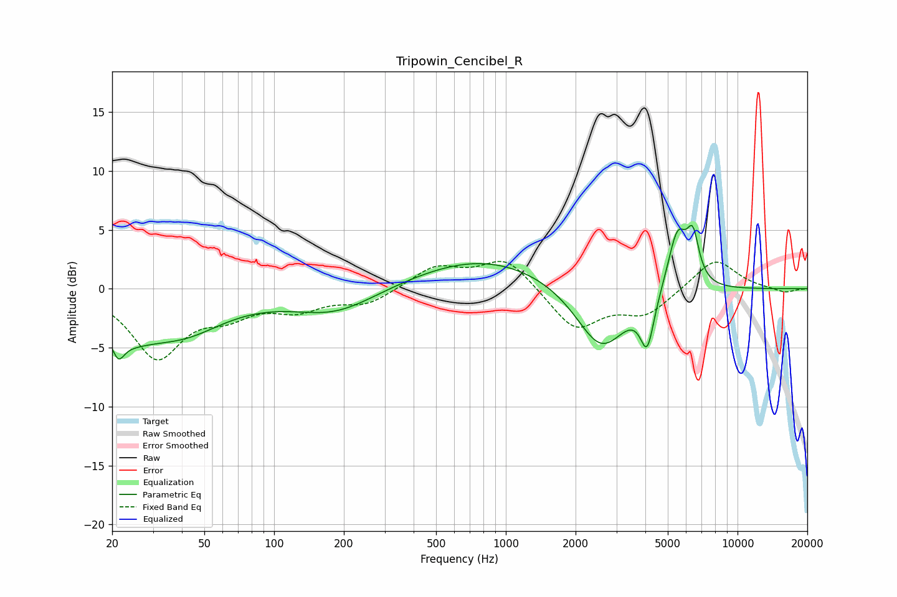

# Tripowin_Cencibel_R
See [usage instructions](https://github.com/jaakkopasanen/AutoEq#usage) for more options and info.

### Parametric EQs
Apply preamp of -5.5 dB when using parametric equalizer.

|   # | Type    |   Fc (Hz) |    Q |   Gain (dB) |
|-----|---------|-----------|------|-------------|
|   1 | Peaking |        21 | 5.64 |        -1.7 |
|   2 | Peaking |        23 | 1.18 |        -2.7 |
|   3 | Peaking |        40 | 0.78 |        -3.1 |
|   4 | Peaking |       141 | 0.18 |        -0.2 |
|   5 | Peaking |       183 | 0.79 |        -2   |
|   6 | Peaking |       798 | 0.46 |         2.8 |
|   7 | Peaking |      2584 | 1.28 |        -5.6 |
|   8 | Peaking |      4075 | 4.77 |        -4.2 |
|   9 | Peaking |      5500 | 3.3  |         5.1 |
|  10 | Peaking |      6417 | 5.2  |         3.7 |

### Fixed Band EQs
When using fixed band (also called graphic) equalizer, apply preamp of **-2.4 dB** (if available) and set gains manually with these parameters.

|   # | Type    |   Fc (Hz) |    Q |   Gain (dB) |
|-----|---------|-----------|------|-------------|
|   1 | Peaking |        31 | 1.41 |        -5.7 |
|   2 | Peaking |        62 | 1.41 |        -1.7 |
|   3 | Peaking |       125 | 1.41 |        -1.5 |
|   4 | Peaking |       250 | 1.41 |        -1.3 |
|   5 | Peaking |       500 | 1.41 |         1.9 |
|   6 | Peaking |      1000 | 1.41 |         2.6 |
|   7 | Peaking |      2000 | 1.41 |        -3.5 |
|   8 | Peaking |      4000 | 1.41 |        -2.1 |
|   9 | Peaking |      8000 | 1.41 |         2.6 |
|  10 | Peaking |     16000 | 1.41 |        -0.4 |

### Graphs

