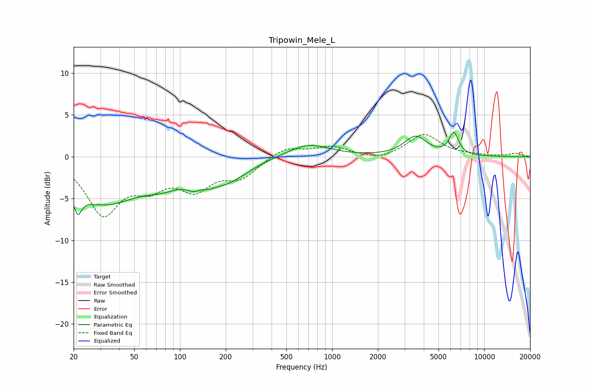

# Tripowin_Mele_L
See [usage instructions](https://github.com/jaakkopasanen/AutoEq#usage) for more options and info.

### Parametric EQs
Apply preamp of -3.0 dB when using parametric equalizer.

|   # | Type    |   Fc (Hz) |    Q |   Gain (dB) |
|-----|---------|-----------|------|-------------|
|   1 | Peaking |        21 | 5.75 |        -5.6 |
|   2 | Peaking |        21 | 5.97 |         3.1 |
|   3 | Peaking |        31 | 0.59 |        -5.3 |
|   4 | Peaking |        77 | 1.17 |        -1.6 |
|   5 | Peaking |       135 | 2.35 |        -4   |
|   6 | Peaking |       137 | 3.16 |         2.6 |
|   7 | Peaking |       208 | 1.05 |        -2.3 |
|   8 | Peaking |       697 | 1.04 |         1.6 |
|   9 | Peaking |      3531 | 1.91 |         2.3 |
|  10 | Peaking |      6306 | 4.46 |         2.6 |

### Fixed Band EQs
When using fixed band (also called graphic) equalizer, apply preamp of **-2.8 dB** (if available) and set gains manually with these parameters.

|   # | Type    |   Fc (Hz) |    Q |   Gain (dB) |
|-----|---------|-----------|------|-------------|
|   1 | Peaking |        31 | 1.41 |        -6.5 |
|   2 | Peaking |        62 | 1.41 |        -2.8 |
|   3 | Peaking |       125 | 1.41 |        -3.4 |
|   4 | Peaking |       250 | 1.41 |        -2.2 |
|   5 | Peaking |       500 | 1.41 |         1.2 |
|   6 | Peaking |      1000 | 1.41 |         1.2 |
|   7 | Peaking |      2000 | 1.41 |        -0.5 |
|   8 | Peaking |      4000 | 1.41 |         2.7 |
|   9 | Peaking |      8000 | 1.41 |         0.1 |
|  10 | Peaking |     16000 | 1.41 |         0.4 |

### Graphs

