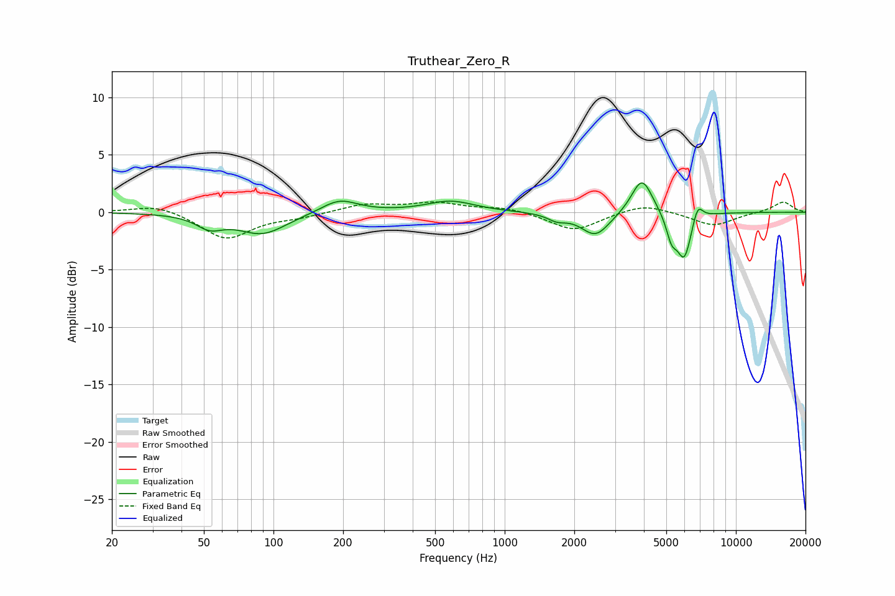

# Truthear_Zero_R
See [usage instructions](https://github.com/jaakkopasanen/AutoEq#usage) for more options and info.

### Parametric EQs
Apply preamp of -2.6 dB when using parametric equalizer.

|   # | Type    |   Fc (Hz) |    Q |   Gain (dB) |
|-----|---------|-----------|------|-------------|
|   1 | Peaking |        53 | 2.49 |        -1.1 |
|   2 | Peaking |        89 | 1.34 |        -1.9 |
|   3 | Peaking |       193 | 1.79 |         1.2 |
|   4 | Peaking |       583 | 1.37 |         1   |
|   5 | Peaking |      1683 | 3.51 |        -0.5 |
|   6 | Peaking |      2471 | 2.29 |        -2.1 |
|   7 | Peaking |      3925 | 3.09 |         3.2 |
|   8 | Peaking |      5269 | 5.96 |        -1.9 |
|   9 | Peaking |      5982 | 4.3  |        -4   |
|  10 | Peaking |      6825 | 5.99 |         1.6 |

### Fixed Band EQs
When using fixed band (also called graphic) equalizer, apply preamp of **-1.0 dB** (if available) and set gains manually with these parameters.

|   # | Type    |   Fc (Hz) |    Q |   Gain (dB) |
|-----|---------|-----------|------|-------------|
|   1 | Peaking |        31 | 1.41 |         0.7 |
|   2 | Peaking |        62 | 1.41 |        -2.3 |
|   3 | Peaking |       125 | 1.41 |        -0.4 |
|   4 | Peaking |       250 | 1.41 |         0.7 |
|   5 | Peaking |       500 | 1.41 |         0.8 |
|   6 | Peaking |      1000 | 1.41 |         0.4 |
|   7 | Peaking |      2000 | 1.41 |        -1.6 |
|   8 | Peaking |      4000 | 1.41 |         0.8 |
|   9 | Peaking |      8000 | 1.41 |        -1.2 |
|  10 | Peaking |     16000 | 1.41 |         0.9 |

### Graphs

