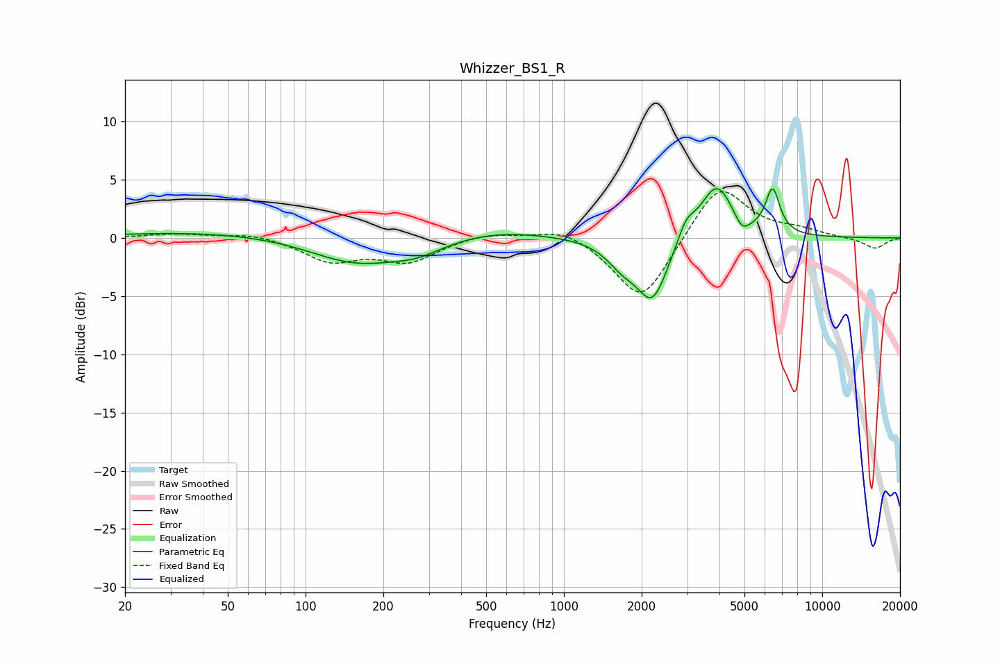

# Whizzer_BS1_R
See [usage instructions](https://github.com/jaakkopasanen/AutoEq#usage) for more options and info.

### Parametric EQs
Apply preamp of -4.3 dB when using parametric equalizer.

|   # | Type    |   Fc (Hz) |    Q |   Gain (dB) |
|-----|---------|-----------|------|-------------|
|   1 | Peaking |        50 | 0.36 |         0.6 |
|   2 | Peaking |       157 | 0.77 |        -2.3 |
|   3 | Peaking |       271 | 1.43 |        -0.9 |
|   4 | Peaking |       545 | 0.7  |         0.8 |
|   5 | Peaking |      1680 | 2.34 |        -1.6 |
|   6 | Peaking |      2203 | 2.3  |        -5.3 |
|   7 | Peaking |      2973 | 4.25 |         1.6 |
|   8 | Peaking |      3902 | 2.19 |         4.7 |
|   9 | Peaking |      4894 | 4.8  |        -1.2 |
|  10 | Peaking |      6427 | 5.03 |         3.8 |

### Fixed Band EQs
When using fixed band (also called graphic) equalizer, apply preamp of **-4.1 dB** (if available) and set gains manually with these parameters.

|   # | Type    |   Fc (Hz) |    Q |   Gain (dB) |
|-----|---------|-----------|------|-------------|
|   1 | Peaking |        31 | 1.41 |         0.3 |
|   2 | Peaking |        62 | 1.41 |         0.4 |
|   3 | Peaking |       125 | 1.41 |        -1.9 |
|   4 | Peaking |       250 | 1.41 |        -1.9 |
|   5 | Peaking |       500 | 1.41 |         0.5 |
|   6 | Peaking |      1000 | 1.41 |         1   |
|   7 | Peaking |      2000 | 1.41 |        -5.7 |
|   8 | Peaking |      4000 | 1.41 |         4.8 |
|   9 | Peaking |      8000 | 1.41 |         0.6 |
|  10 | Peaking |     16000 | 1.41 |        -0.9 |

### Graphs

