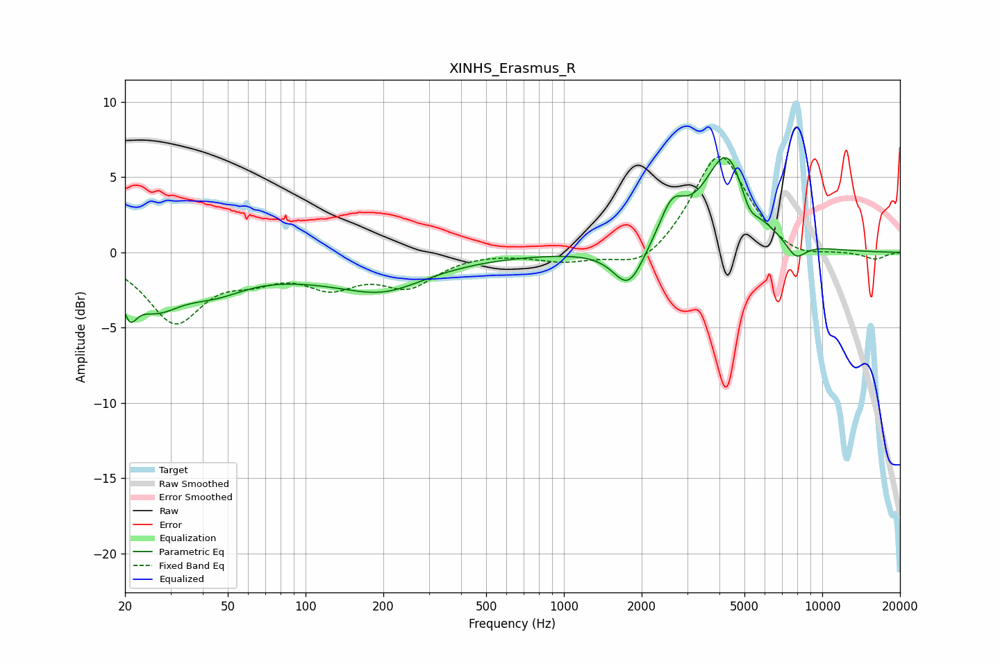

# XINHS_Erasmus_R
See [usage instructions](https://github.com/jaakkopasanen/AutoEq#usage) for more options and info.

### Parametric EQs
Apply preamp of -6.4 dB when using parametric equalizer.

|   # | Type    |   Fc (Hz) |    Q |   Gain (dB) |
|-----|---------|-----------|------|-------------|
|   1 | Peaking |        21 | 5.15 |        -2   |
|   2 | Peaking |        26 | 1.4  |        -2.8 |
|   3 | Peaking |        44 | 1.05 |        -1.7 |
|   4 | Peaking |       142 | 0.45 |        -1.4 |
|   5 | Peaking |       203 | 0.97 |        -1.2 |
|   6 | Peaking |      1780 | 2.39 |        -2.7 |
|   7 | Peaking |      2620 | 2.86 |         2.4 |
|   8 | Peaking |      4292 | 1.57 |         6.6 |
|   9 | Peaking |      5199 | 3.81 |        -1.5 |
|  10 | Peaking |      7899 | 3.33 |        -1.2 |

### Fixed Band EQs
When using fixed band (also called graphic) equalizer, apply preamp of **-6.5 dB** (if available) and set gains manually with these parameters.

|   # | Type    |   Fc (Hz) |    Q |   Gain (dB) |
|-----|---------|-----------|------|-------------|
|   1 | Peaking |        31 | 1.41 |        -4.5 |
|   2 | Peaking |        62 | 1.41 |        -1.2 |
|   3 | Peaking |       125 | 1.41 |        -1.9 |
|   4 | Peaking |       250 | 1.41 |        -2   |
|   5 | Peaking |       500 | 1.41 |         0.1 |
|   6 | Peaking |      1000 | 1.41 |        -0.6 |
|   7 | Peaking |      2000 | 1.41 |        -1.3 |
|   8 | Peaking |      4000 | 1.41 |         6.7 |
|   9 | Peaking |      8000 | 1.41 |        -0.7 |
|  10 | Peaking |     16000 | 1.41 |        -0.5 |

### Graphs

