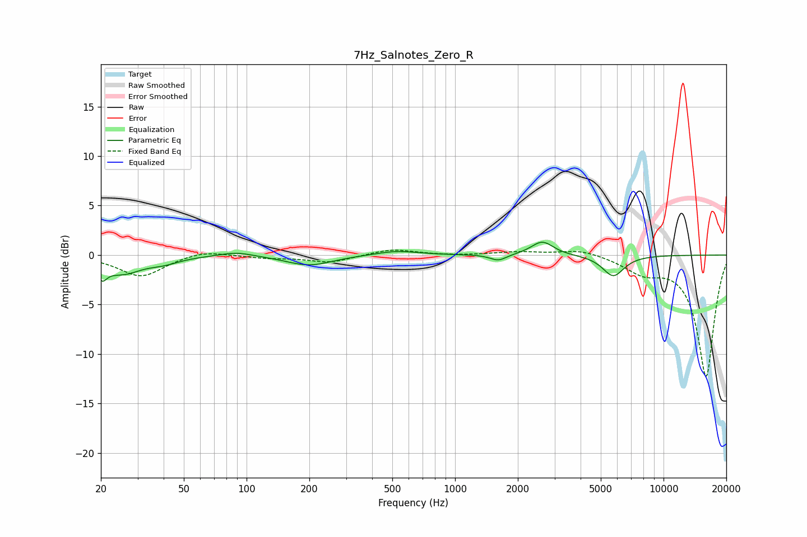

# 7Hz_Salnotes_Zero_R
See [usage instructions](https://github.com/jaakkopasanen/AutoEq#usage) for more options and info.

### Parametric EQs
Apply preamp of -1.4 dB when using parametric equalizer.

|   # | Type    |   Fc (Hz) |    Q |   Gain (dB) |
|-----|---------|-----------|------|-------------|
|   1 | Peaking |        20 | 5.98 |        -2.4 |
|   2 | Peaking |        20 | 5.99 |         1   |
|   3 | Peaking |        25 | 1.53 |        -1.7 |
|   4 | Peaking |        40 | 1.86 |        -0.5 |
|   5 | Peaking |        89 | 1.8  |         0.4 |
|   6 | Peaking |       200 | 1.29 |        -1.1 |
|   7 | Peaking |       523 | 1.4  |         0.5 |
|   8 | Peaking |      1613 | 3.62 |        -0.6 |
|   9 | Peaking |      2620 | 2.7  |         1.4 |
|  10 | Peaking |      5741 | 2.69 |        -2.1 |

### Fixed Band EQs
When using fixed band (also called graphic) equalizer, apply preamp of **-0.6 dB** (if available) and set gains manually with these parameters.

|   # | Type    |   Fc (Hz) |    Q |   Gain (dB) |
|-----|---------|-----------|------|-------------|
|   1 | Peaking |        31 | 1.41 |        -2.2 |
|   2 | Peaking |        62 | 1.41 |         0.6 |
|   3 | Peaking |       125 | 1.41 |        -0.3 |
|   4 | Peaking |       250 | 1.41 |        -0.7 |
|   5 | Peaking |       500 | 1.41 |         0.6 |
|   6 | Peaking |      1000 | 1.41 |        -0.1 |
|   7 | Peaking |      2000 | 1.41 |         0.3 |
|   8 | Peaking |      4000 | 1.41 |         0.6 |
|   9 | Peaking |      8000 | 1.41 |        -1.5 |
|  10 | Peaking |     16000 | 1.41 |       -12.3 |

### Graphs

