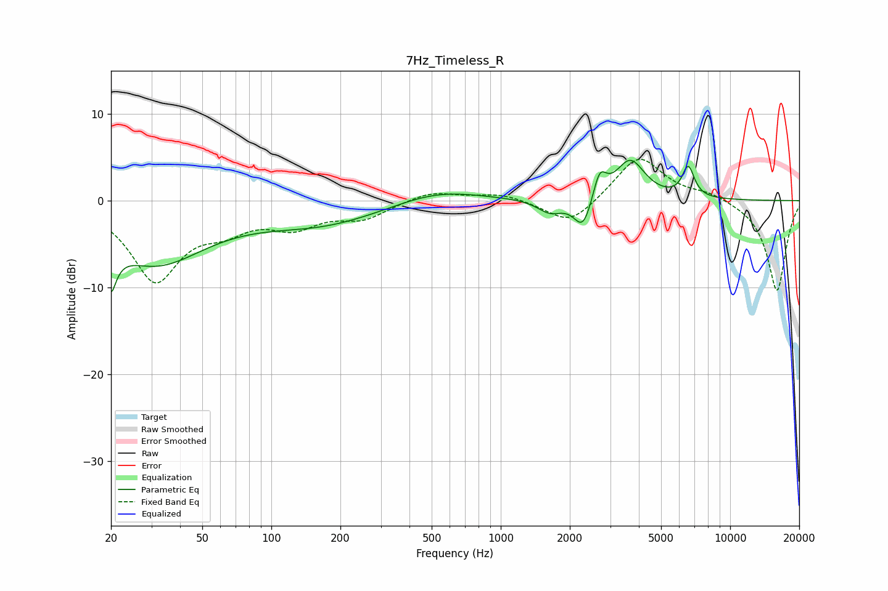

# 7Hz_Timeless_R
See [usage instructions](https://github.com/jaakkopasanen/AutoEq#usage) for more options and info.

### Parametric EQs
Apply preamp of -4.7 dB when using parametric equalizer.

|   # | Type    |   Fc (Hz) |    Q |   Gain (dB) |
|-----|---------|-----------|------|-------------|
|   1 | Peaking |        20 | 5.68 |        -8.5 |
|   2 | Peaking |        20 | 5.93 |         3.3 |
|   3 | Peaking |        31 | 0.63 |        -7   |
|   4 | Peaking |       166 | 0.52 |        -2.6 |
|   5 | Peaking |       526 | 0.74 |         1.5 |
|   6 | Peaking |      1641 | 2.54 |        -1.5 |
|   7 | Peaking |      2286 | 3.57 |        -3.7 |
|   8 | Peaking |      2698 | 4.99 |         3.1 |
|   9 | Peaking |      3668 | 2.19 |         4.6 |
|  10 | Peaking |      6566 | 5.21 |         3.5 |

### Fixed Band EQs
When using fixed band (also called graphic) equalizer, apply preamp of **-4.8 dB** (if available) and set gains manually with these parameters.

|   # | Type    |   Fc (Hz) |    Q |   Gain (dB) |
|-----|---------|-----------|------|-------------|
|   1 | Peaking |        31 | 1.41 |        -8.9 |
|   2 | Peaking |        62 | 1.41 |        -2.4 |
|   3 | Peaking |       125 | 1.41 |        -2.6 |
|   4 | Peaking |       250 | 1.41 |        -1.9 |
|   5 | Peaking |       500 | 1.41 |         1.1 |
|   6 | Peaking |      1000 | 1.41 |         0.8 |
|   7 | Peaking |      2000 | 1.41 |        -3   |
|   8 | Peaking |      4000 | 1.41 |         5.2 |
|   9 | Peaking |      8000 | 1.41 |         0.8 |
|  10 | Peaking |     16000 | 1.41 |       -10.5 |

### Graphs

