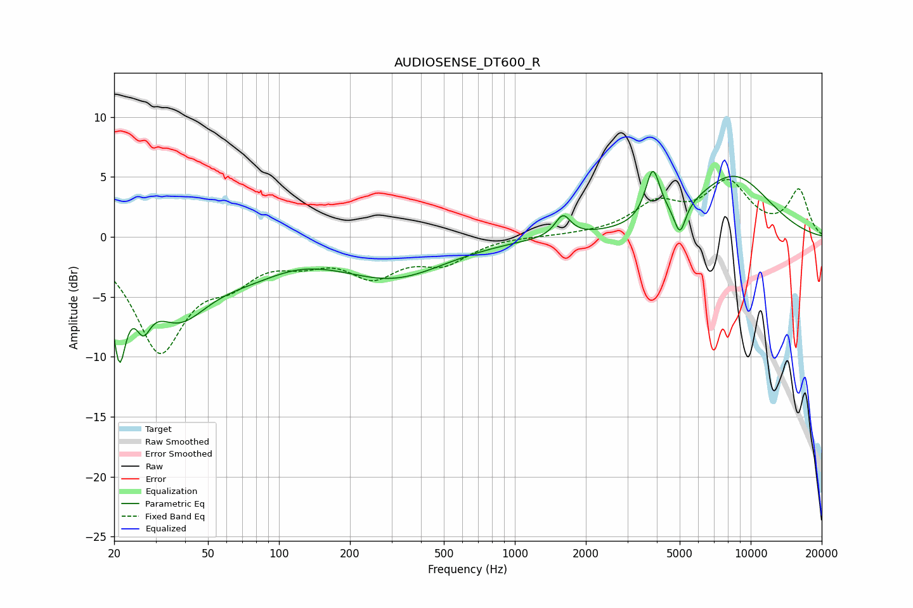

# AUDIOSENSE_DT600_R
See [usage instructions](https://github.com/jaakkopasanen/AutoEq#usage) for more options and info.

### Parametric EQs
Apply preamp of -5.6 dB when using parametric equalizer.

|   # | Type    |   Fc (Hz) |    Q |   Gain (dB) |
|-----|---------|-----------|------|-------------|
|   1 | Peaking |        21 | 5.08 |        -7.4 |
|   2 | Peaking |        27 | 4.42 |        -2.9 |
|   3 | Peaking |        37 | 1.09 |        -5.5 |
|   4 | Peaking |        80 | 0.64 |        -2.7 |
|   5 | Peaking |       113 | 0.9  |         0.9 |
|   6 | Peaking |       308 | 0.64 |        -3.1 |
|   7 | Peaking |      1599 | 4.35 |         1.8 |
|   8 | Peaking |      3845 | 4.58 |         4.2 |
|   9 | Peaking |      5012 | 5.71 |        -2.5 |
|  10 | Peaking |      8411 | 0.77 |         5   |

### Fixed Band EQs
When using fixed band (also called graphic) equalizer, apply preamp of **-4.9 dB** (if available) and set gains manually with these parameters.

|   # | Type    |   Fc (Hz) |    Q |   Gain (dB) |
|-----|---------|-----------|------|-------------|
|   1 | Peaking |        31 | 1.41 |        -9.2 |
|   2 | Peaking |        62 | 1.41 |        -2.6 |
|   3 | Peaking |       125 | 1.41 |        -1.4 |
|   4 | Peaking |       250 | 1.41 |        -2.9 |
|   5 | Peaking |       500 | 1.41 |        -1.9 |
|   6 | Peaking |      1000 | 1.41 |         0.1 |
|   7 | Peaking |      2000 | 1.41 |         0.1 |
|   8 | Peaking |      4000 | 1.41 |         2.5 |
|   9 | Peaking |      8000 | 1.41 |         4.2 |
|  10 | Peaking |     16000 | 1.41 |         3.8 |

### Graphs

