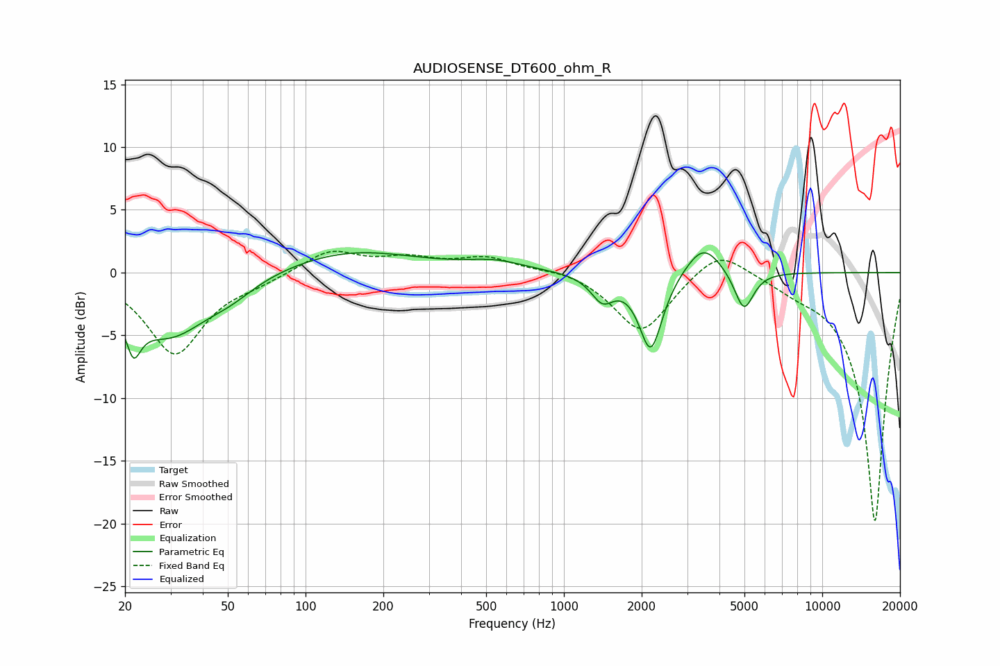

# AUDIOSENSE_DT600_ohm_R
See [usage instructions](https://github.com/jaakkopasanen/AutoEq#usage) for more options and info.

### Parametric EQs
Apply preamp of -1.7 dB when using parametric equalizer.

|   # | Type    |   Fc (Hz) |    Q |   Gain (dB) |
|-----|---------|-----------|------|-------------|
|   1 | Peaking |        22 | 5.39 |        -6.4 |
|   2 | Peaking |        22 | 6    |         3.2 |
|   3 | Peaking |        30 | 0.92 |        -4.9 |
|   4 | Peaking |        51 | 1.5  |        -0.9 |
|   5 | Peaking |       149 | 0.55 |         1.8 |
|   6 | Peaking |       543 | 1.27 |         0.7 |
|   7 | Peaking |      1410 | 3.17 |        -2   |
|   8 | Peaking |      2169 | 3.13 |        -6.2 |
|   9 | Peaking |      3464 | 2.04 |         2.5 |
|  10 | Peaking |      4975 | 3.79 |        -3.2 |

### Fixed Band EQs
When using fixed band (also called graphic) equalizer, apply preamp of **-1.8 dB** (if available) and set gains manually with these parameters.

|   # | Type    |   Fc (Hz) |    Q |   Gain (dB) |
|-----|---------|-----------|------|-------------|
|   1 | Peaking |        31 | 1.41 |        -6.5 |
|   2 | Peaking |        62 | 1.41 |        -0.6 |
|   3 | Peaking |       125 | 1.41 |         1.8 |
|   4 | Peaking |       250 | 1.41 |         1   |
|   5 | Peaking |       500 | 1.41 |         1.1 |
|   6 | Peaking |      1000 | 1.41 |         0.4 |
|   7 | Peaking |      2000 | 1.41 |        -4.8 |
|   8 | Peaking |      4000 | 1.41 |         2.3 |
|   9 | Peaking |      8000 | 1.41 |        -0.7 |
|  10 | Peaking |     16000 | 1.41 |       -20   |

### Graphs

