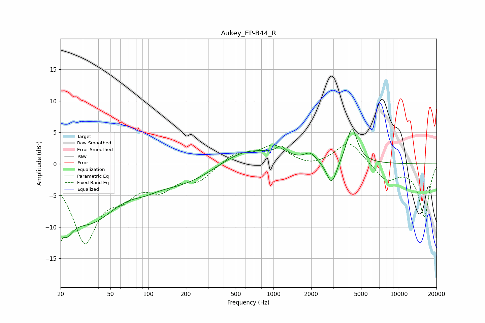

# Aukey_EP-B44_R
See [usage instructions](https://github.com/jaakkopasanen/AutoEq#usage) for more options and info.

### Parametric EQs
Apply preamp of -5.5 dB when using parametric equalizer.

|   # | Type    |   Fc (Hz) |    Q |   Gain (dB) |
|-----|---------|-----------|------|-------------|
|   1 | Peaking |        20 | 2.38 |       -10.3 |
|   2 | Peaking |        21 | 5.91 |         3.2 |
|   3 | Peaking |        36 | 0.67 |        -7.8 |
|   4 | Peaking |        93 | 1.43 |        -0.8 |
|   5 | Peaking |       201 | 0.47 |        -3.3 |
|   6 | Peaking |       589 | 0.59 |         3.2 |
|   7 | Peaking |      1151 | 3.8  |         1.4 |
|   8 | Peaking |      1970 | 3.11 |         1.3 |
|   9 | Peaking |      2910 | 3.44 |        -3.9 |
|  10 | Peaking |      4226 | 3.25 |         5.7 |

### Fixed Band EQs
When using fixed band (also called graphic) equalizer, apply preamp of **-3.3 dB** (if available) and set gains manually with these parameters.

|   # | Type    |   Fc (Hz) |    Q |   Gain (dB) |
|-----|---------|-----------|------|-------------|
|   1 | Peaking |        31 | 1.41 |       -11.9 |
|   2 | Peaking |        62 | 1.41 |        -3.4 |
|   3 | Peaking |       125 | 1.41 |        -3.3 |
|   4 | Peaking |       250 | 1.41 |        -2.4 |
|   5 | Peaking |       500 | 1.41 |         1.7 |
|   6 | Peaking |      1000 | 1.41 |         2.8 |
|   7 | Peaking |      2000 | 1.41 |        -0.6 |
|   8 | Peaking |      4000 | 1.41 |         3.6 |
|   9 | Peaking |      8000 | 1.41 |        -2.6 |
|  10 | Peaking |     16000 | 1.41 |        -8.3 |

### Graphs

