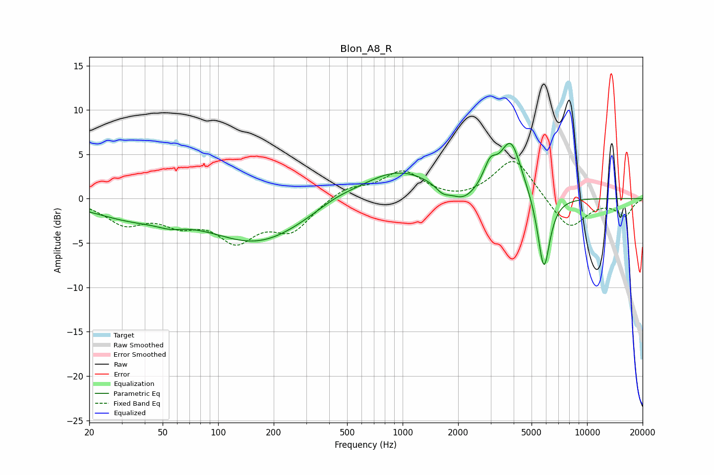

# Blon_A8_R
See [usage instructions](https://github.com/jaakkopasanen/AutoEq#usage) for more options and info.

### Parametric EQs
Apply preamp of -6.3 dB when using parametric equalizer.

|   # | Type    |   Fc (Hz) |    Q |   Gain (dB) |
|-----|---------|-----------|------|-------------|
|   1 | Peaking |        33 | 0.66 |        -1.8 |
|   2 | Peaking |        55 | 1.97 |        -0.6 |
|   3 | Peaking |       164 | 0.54 |        -4.8 |
|   4 | Peaking |       431 | 1.28 |         0.7 |
|   5 | Peaking |       936 | 0.7  |         3.3 |
|   6 | Peaking |      1646 | 3.75 |        -0.9 |
|   7 | Peaking |      2127 | 2.04 |        -1.6 |
|   8 | Peaking |      2979 | 3.94 |         2.5 |
|   9 | Peaking |      3861 | 2.37 |         6.2 |
|  10 | Peaking |      5831 | 4.1  |        -8.7 |

### Fixed Band EQs
When using fixed band (also called graphic) equalizer, apply preamp of **-4.3 dB** (if available) and set gains manually with these parameters.

|   # | Type    |   Fc (Hz) |    Q |   Gain (dB) |
|-----|---------|-----------|------|-------------|
|   1 | Peaking |        31 | 1.41 |        -2.6 |
|   2 | Peaking |        62 | 1.41 |        -2.3 |
|   3 | Peaking |       125 | 1.41 |        -4.2 |
|   4 | Peaking |       250 | 1.41 |        -3.3 |
|   5 | Peaking |       500 | 1.41 |         1.3 |
|   6 | Peaking |      1000 | 1.41 |         3   |
|   7 | Peaking |      2000 | 1.41 |        -0.4 |
|   8 | Peaking |      4000 | 1.41 |         4.7 |
|   9 | Peaking |      8000 | 1.41 |        -3.6 |
|  10 | Peaking |     16000 | 1.41 |        -1.9 |

### Graphs

