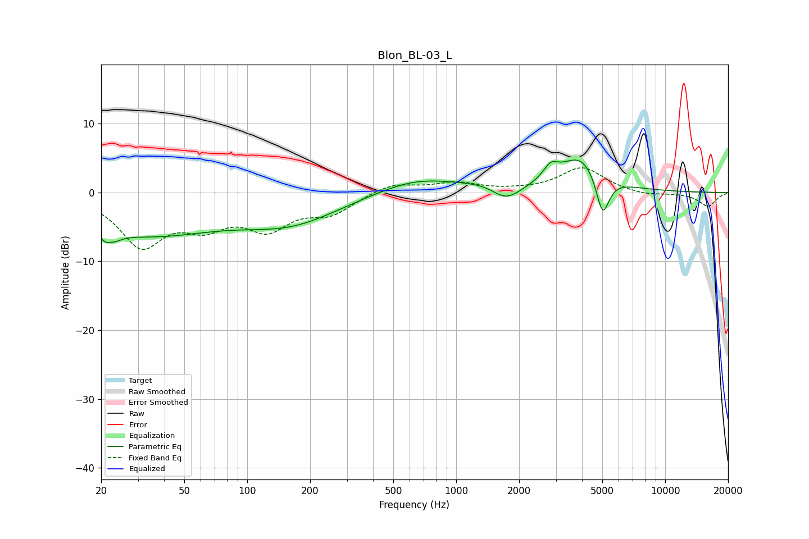

# Blon_BL-03_L
See [usage instructions](https://github.com/jaakkopasanen/AutoEq#usage) for more options and info.

### Parametric EQs
Apply preamp of -4.8 dB when using parametric equalizer.

|   # | Type    |   Fc (Hz) |    Q |   Gain (dB) |
|-----|---------|-----------|------|-------------|
|   1 | Peaking |        22 | 4.44 |        -5.2 |
|   2 | Peaking |        22 | 5.6  |         3.4 |
|   3 | Peaking |        33 | 0.4  |        -5.8 |
|   4 | Peaking |       163 | 0.59 |        -3.9 |
|   5 | Peaking |       649 | 0.73 |         2.2 |
|   6 | Peaking |      1468 | 1.25 |         1   |
|   7 | Peaking |      1725 | 1.93 |        -2.6 |
|   8 | Peaking |      2831 | 4    |         1.9 |
|   9 | Peaking |      3968 | 1.33 |         5.3 |
|  10 | Peaking |      5019 | 4.29 |        -6.2 |

### Fixed Band EQs
When using fixed band (also called graphic) equalizer, apply preamp of **-3.7 dB** (if available) and set gains manually with these parameters.

|   # | Type    |   Fc (Hz) |    Q |   Gain (dB) |
|-----|---------|-----------|------|-------------|
|   1 | Peaking |        31 | 1.41 |        -7.4 |
|   2 | Peaking |        62 | 1.41 |        -3.9 |
|   3 | Peaking |       125 | 1.41 |        -4.6 |
|   4 | Peaking |       250 | 1.41 |        -2.7 |
|   5 | Peaking |       500 | 1.41 |         1.4 |
|   6 | Peaking |      1000 | 1.41 |         1.3 |
|   7 | Peaking |      2000 | 1.41 |         0.1 |
|   8 | Peaking |      4000 | 1.41 |         3.6 |
|   9 | Peaking |      8000 | 1.41 |        -0.5 |
|  10 | Peaking |     16000 | 1.41 |        -2   |

### Graphs

