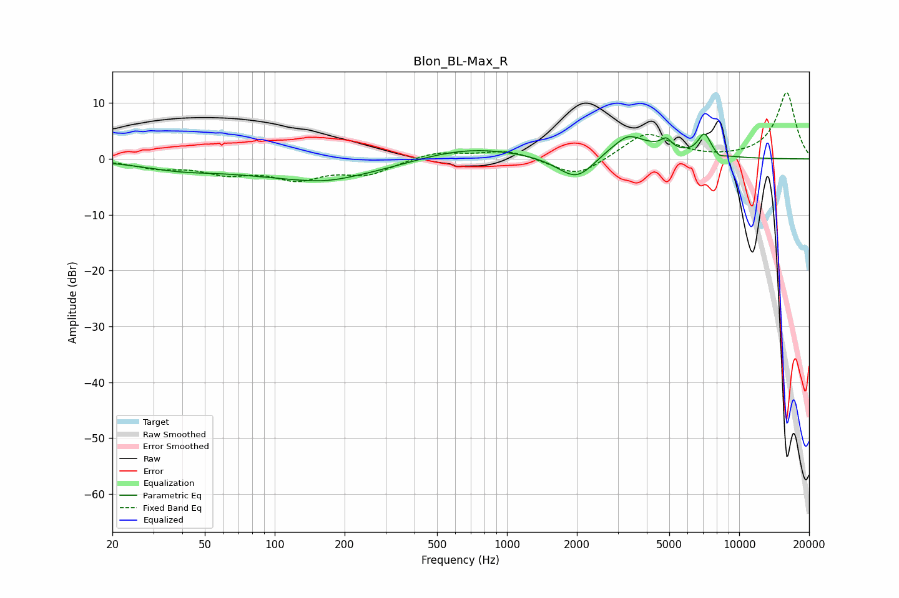

# Blon_BL-Max_R
See [usage instructions](https://github.com/jaakkopasanen/AutoEq#usage) for more options and info.

### Parametric EQs
Apply preamp of -4.5 dB when using parametric equalizer.

|   # | Type    |   Fc (Hz) |    Q |   Gain (dB) |
|-----|---------|-----------|------|-------------|
|   1 | Peaking |        39 | 0.86 |        -1.3 |
|   2 | Peaking |       159 | 0.43 |        -3.7 |
|   3 | Peaking |       167 | 1.49 |        -0.5 |
|   4 | Peaking |       663 | 0.59 |         2.5 |
|   5 | Peaking |      2001 | 1.68 |        -4.9 |
|   6 | Peaking |      3316 | 3.76 |         0.9 |
|   7 | Peaking |      3337 | 1.19 |         3.9 |
|   8 | Peaking |      4851 | 6    |         1.8 |
|   9 | Peaking |      7090 | 4.8  |         3.9 |
|  10 | Peaking |      8210 | 6    |        -0.7 |

### Fixed Band EQs
When using fixed band (also called graphic) equalizer, apply preamp of **-12.0 dB** (if available) and set gains manually with these parameters.

|   # | Type    |   Fc (Hz) |    Q |   Gain (dB) |
|-----|---------|-----------|------|-------------|
|   1 | Peaking |        31 | 1.41 |        -1.4 |
|   2 | Peaking |        62 | 1.41 |        -2.2 |
|   3 | Peaking |       125 | 1.41 |        -3.2 |
|   4 | Peaking |       250 | 1.41 |        -2.5 |
|   5 | Peaking |       500 | 1.41 |         1.3 |
|   6 | Peaking |      1000 | 1.41 |         1.6 |
|   7 | Peaking |      2000 | 1.41 |        -3.4 |
|   8 | Peaking |      4000 | 1.41 |         4.8 |
|   9 | Peaking |      8000 | 1.41 |        -0.1 |
|  10 | Peaking |     16000 | 1.41 |        11.9 |

### Graphs

