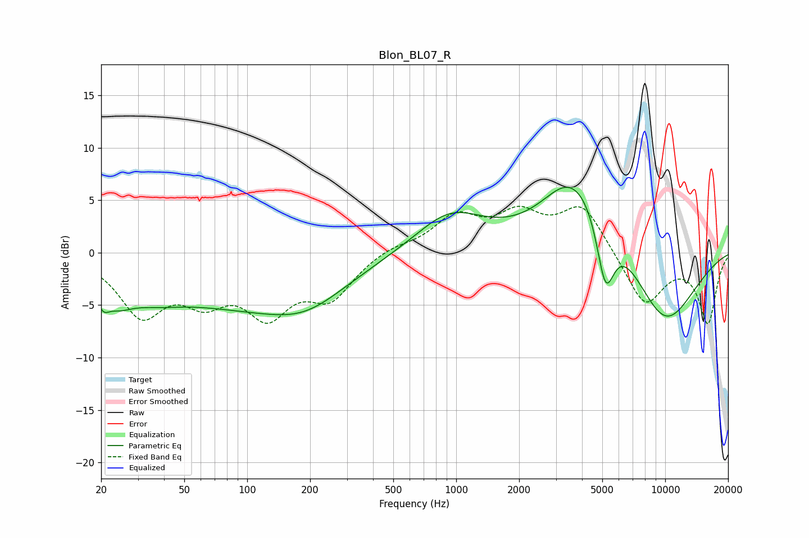

# Blon_BL07_R
See [usage instructions](https://github.com/jaakkopasanen/AutoEq#usage) for more options and info.

### Parametric EQs
Apply preamp of -6.3 dB when using parametric equalizer.

|   # | Type    |   Fc (Hz) |    Q |   Gain (dB) |
|-----|---------|-----------|------|-------------|
|   1 | Peaking |        20 | 4.68 |        -1.9 |
|   2 | Peaking |        24 | 2    |        -2   |
|   3 | Peaking |        34 | 0.89 |        -2.1 |
|   4 | Peaking |       100 | 0.36 |        -4.4 |
|   5 | Peaking |       193 | 0.79 |        -2.2 |
|   6 | Peaking |       934 | 0.86 |         3.7 |
|   7 | Peaking |      3350 | 1.22 |         2.3 |
|   8 | Peaking |      4474 | 0.74 |         7.1 |
|   9 | Peaking |      5178 | 3.03 |        -7.4 |
|  10 | Peaking |      9754 | 0.75 |        -7.9 |

### Fixed Band EQs
When using fixed band (also called graphic) equalizer, apply preamp of **-4.5 dB** (if available) and set gains manually with these parameters.

|   # | Type    |   Fc (Hz) |    Q |   Gain (dB) |
|-----|---------|-----------|------|-------------|
|   1 | Peaking |        31 | 1.41 |        -5.5 |
|   2 | Peaking |        62 | 1.41 |        -3.6 |
|   3 | Peaking |       125 | 1.41 |        -5.2 |
|   4 | Peaking |       250 | 1.41 |        -3.9 |
|   5 | Peaking |       500 | 1.41 |         0.6 |
|   6 | Peaking |      1000 | 1.41 |         3.2 |
|   7 | Peaking |      2000 | 1.41 |         3.2 |
|   8 | Peaking |      4000 | 1.41 |         4.4 |
|   9 | Peaking |      8000 | 1.41 |        -5.1 |
|  10 | Peaking |     16000 | 1.41 |        -6.6 |

### Graphs

