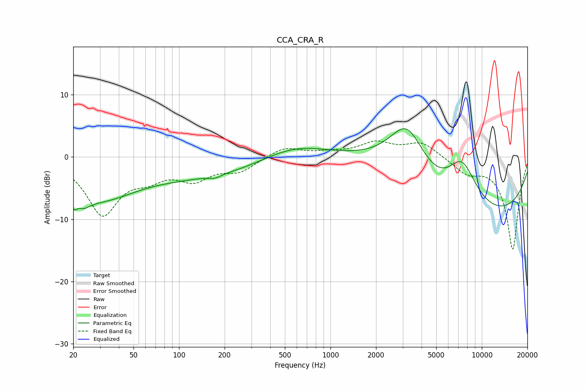

# CCA_CRA_R
See [usage instructions](https://github.com/jaakkopasanen/AutoEq#usage) for more options and info.

### Parametric EQs
Apply preamp of -4.6 dB when using parametric equalizer.

|   # | Type    |   Fc (Hz) |    Q |   Gain (dB) |
|-----|---------|-----------|------|-------------|
|   1 | Peaking |        21 | 2.77 |        -4.5 |
|   2 | Peaking |        22 | 5.96 |         1.6 |
|   3 | Peaking |        30 | 0.59 |        -5.8 |
|   4 | Peaking |       173 | 3.89 |        -0.5 |
|   5 | Peaking |       200 | 0.27 |        -3.3 |
|   6 | Peaking |       554 | 0.6  |         3.3 |
|   7 | Peaking |      3207 | 1.1  |         9.2 |
|   8 | Peaking |      3243 | 0.24 |        10.7 |
|   9 | Peaking |      5978 | 0.23 |       -20   |
|  10 | Peaking |      7376 | 1.23 |         8.7 |

### Fixed Band EQs
When using fixed band (also called graphic) equalizer, apply preamp of **-2.7 dB** (if available) and set gains manually with these parameters.

|   # | Type    |   Fc (Hz) |    Q |   Gain (dB) |
|-----|---------|-----------|------|-------------|
|   1 | Peaking |        31 | 1.41 |        -8.9 |
|   2 | Peaking |        62 | 1.41 |        -2.4 |
|   3 | Peaking |       125 | 1.41 |        -3.2 |
|   4 | Peaking |       250 | 1.41 |        -2.1 |
|   5 | Peaking |       500 | 1.41 |         1.6 |
|   6 | Peaking |      1000 | 1.41 |         0.5 |
|   7 | Peaking |      2000 | 1.41 |         2.1 |
|   8 | Peaking |      4000 | 1.41 |         2.3 |
|   9 | Peaking |      8000 | 1.41 |        -2.3 |
|  10 | Peaking |     16000 | 1.41 |       -14.8 |

### Graphs

