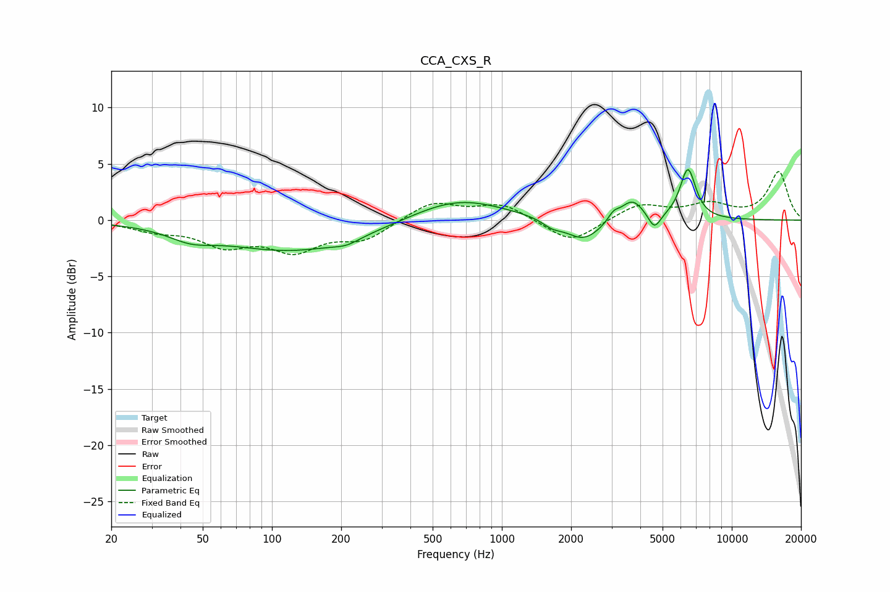

# CCA_CXS_R
See [usage instructions](https://github.com/jaakkopasanen/AutoEq#usage) for more options and info.

### Parametric EQs
Apply preamp of -4.6 dB when using parametric equalizer.

|   # | Type    |   Fc (Hz) |    Q |   Gain (dB) |
|-----|---------|-----------|------|-------------|
|   1 | Peaking |        44 | 1.5  |        -0.9 |
|   2 | Peaking |       124 | 0.45 |        -2.7 |
|   3 | Peaking |       211 | 2.54 |        -0.5 |
|   4 | Peaking |       641 | 0.7  |         2.1 |
|   5 | Peaking |      1651 | 3.48 |        -0.6 |
|   6 | Peaking |      2267 | 1.76 |        -2   |
|   7 | Peaking |      3058 | 5.96 |         0.7 |
|   8 | Peaking |      3683 | 2.68 |         1.9 |
|   9 | Peaking |      4605 | 5.15 |        -1.5 |
|  10 | Peaking |      6444 | 4    |         4.5 |

### Fixed Band EQs
When using fixed band (also called graphic) equalizer, apply preamp of **-4.4 dB** (if available) and set gains manually with these parameters.

|   # | Type    |   Fc (Hz) |    Q |   Gain (dB) |
|-----|---------|-----------|------|-------------|
|   1 | Peaking |        31 | 1.41 |        -0.8 |
|   2 | Peaking |        62 | 1.41 |        -2   |
|   3 | Peaking |       125 | 1.41 |        -2.4 |
|   4 | Peaking |       250 | 1.41 |        -1.6 |
|   5 | Peaking |       500 | 1.41 |         1.6 |
|   6 | Peaking |      1000 | 1.41 |         1.4 |
|   7 | Peaking |      2000 | 1.41 |        -2.1 |
|   8 | Peaking |      4000 | 1.41 |         1.4 |
|   9 | Peaking |      8000 | 1.41 |         1.3 |
|  10 | Peaking |     16000 | 1.41 |         4.3 |

### Graphs

