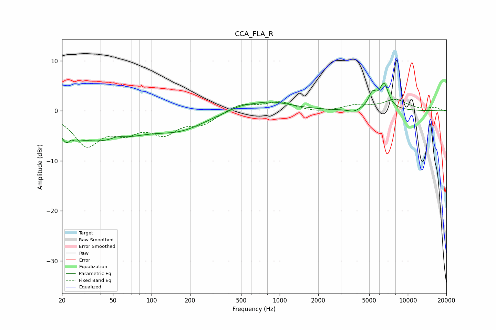

# CCA_FLA_R
See [usage instructions](https://github.com/jaakkopasanen/AutoEq#usage) for more options and info.

### Parametric EQs
Apply preamp of -5.6 dB when using parametric equalizer.

|   # | Type    |   Fc (Hz) |    Q |   Gain (dB) |
|-----|---------|-----------|------|-------------|
|   1 | Peaking |        23 | 3.76 |        -5   |
|   2 | Peaking |        23 | 5.39 |         3.6 |
|   3 | Peaking |        40 | 0.45 |        -5.7 |
|   4 | Peaking |        54 | 2.88 |         0.7 |
|   5 | Peaking |       172 | 0.74 |        -2.8 |
|   6 | Peaking |       492 | 1.44 |         0.8 |
|   7 | Peaking |       845 | 0.85 |         1.8 |
|   8 | Peaking |      3791 | 3.09 |        -0.6 |
|   9 | Peaking |      5299 | 4.41 |         2.9 |
|  10 | Peaking |      6525 | 3.88 |         5   |

### Fixed Band EQs
When using fixed band (also called graphic) equalizer, apply preamp of **-2.4 dB** (if available) and set gains manually with these parameters.

|   # | Type    |   Fc (Hz) |    Q |   Gain (dB) |
|-----|---------|-----------|------|-------------|
|   1 | Peaking |        31 | 1.41 |        -6.5 |
|   2 | Peaking |        62 | 1.41 |        -3.3 |
|   3 | Peaking |       125 | 1.41 |        -3.9 |
|   4 | Peaking |       250 | 1.41 |        -2.3 |
|   5 | Peaking |       500 | 1.41 |         1.5 |
|   6 | Peaking |      1000 | 1.41 |         1.7 |
|   7 | Peaking |      2000 | 1.41 |        -0.4 |
|   8 | Peaking |      4000 | 1.41 |         1   |
|   9 | Peaking |      8000 | 1.41 |         2.1 |
|  10 | Peaking |     16000 | 1.41 |         0.6 |

### Graphs

