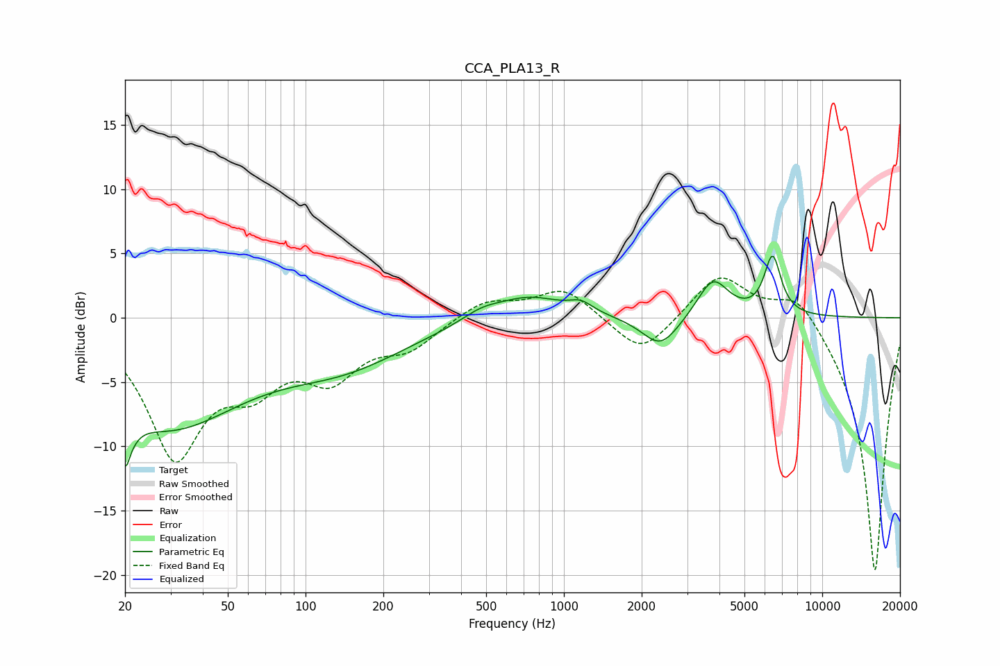

# CCA_PLA13_R
See [usage instructions](https://github.com/jaakkopasanen/AutoEq#usage) for more options and info.

### Parametric EQs
Apply preamp of -4.9 dB when using parametric equalizer.

|   # | Type    |   Fc (Hz) |    Q |   Gain (dB) |
|-----|---------|-----------|------|-------------|
|   1 | Peaking |        20 | 5.78 |        -9.9 |
|   2 | Peaking |        20 | 6    |         5.6 |
|   3 | Peaking |        29 | 0.48 |        -8.1 |
|   4 | Peaking |       142 | 0.57 |        -3   |
|   5 | Peaking |       479 | 1.79 |         0.8 |
|   6 | Peaking |       733 | 1.08 |         1.8 |
|   7 | Peaking |      1165 | 3.03 |         0.8 |
|   8 | Peaking |      2367 | 1.97 |        -2.5 |
|   9 | Peaking |      3775 | 2.34 |         3.1 |
|  10 | Peaking |      6424 | 4.28 |         4.6 |

### Fixed Band EQs
When using fixed band (also called graphic) equalizer, apply preamp of **-3.2 dB** (if available) and set gains manually with these parameters.

|   # | Type    |   Fc (Hz) |    Q |   Gain (dB) |
|-----|---------|-----------|------|-------------|
|   1 | Peaking |        31 | 1.41 |       -10.3 |
|   2 | Peaking |        62 | 1.41 |        -4   |
|   3 | Peaking |       125 | 1.41 |        -4   |
|   4 | Peaking |       250 | 1.41 |        -2   |
|   5 | Peaking |       500 | 1.41 |         1.4 |
|   6 | Peaking |      1000 | 1.41 |         2.3 |
|   7 | Peaking |      2000 | 1.41 |        -3   |
|   8 | Peaking |      4000 | 1.41 |         3.5 |
|   9 | Peaking |      8000 | 1.41 |         2.5 |
|  10 | Peaking |     16000 | 1.41 |       -20   |

### Graphs

