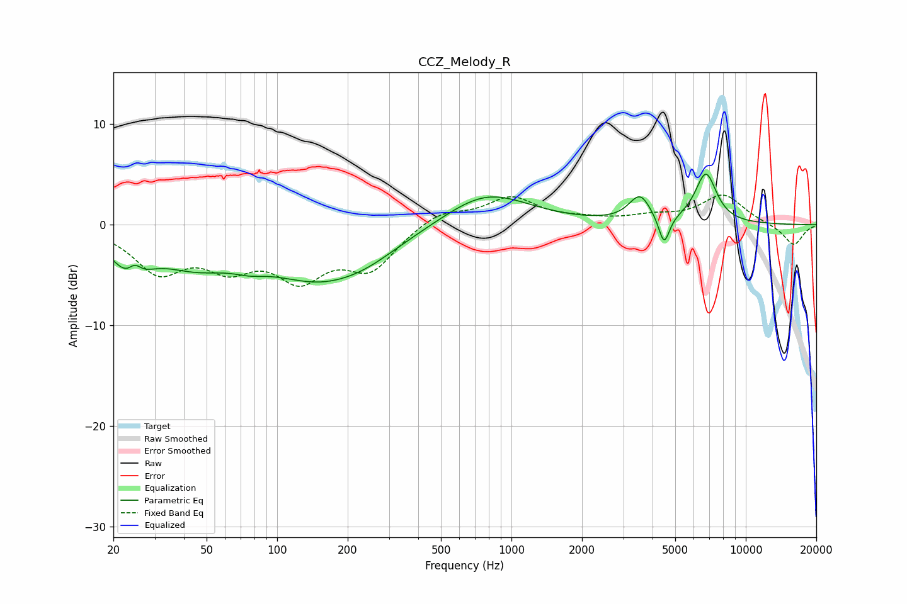

# CCZ_Melody_R
See [usage instructions](https://github.com/jaakkopasanen/AutoEq#usage) for more options and info.

### Parametric EQs
Apply preamp of -5.1 dB when using parametric equalizer.

|   # | Type    |   Fc (Hz) |    Q |   Gain (dB) |
|-----|---------|-----------|------|-------------|
|   1 | Peaking |        24 | 1.88 |        -3.7 |
|   2 | Peaking |        25 | 5.11 |         1.4 |
|   3 | Peaking |        44 | 0.87 |        -2.9 |
|   4 | Peaking |        76 | 2.08 |        -0.6 |
|   5 | Peaking |       158 | 0.56 |        -5.3 |
|   6 | Peaking |       246 | 1.26 |        -0.5 |
|   7 | Peaking |       778 | 0.77 |         3.4 |
|   8 | Peaking |      3533 | 3.04 |         2.6 |
|   9 | Peaking |      4482 | 6    |        -3   |
|  10 | Peaking |      6756 | 2.97 |         4.9 |

### Fixed Band EQs
When using fixed band (also called graphic) equalizer, apply preamp of **-3.0 dB** (if available) and set gains manually with these parameters.

|   # | Type    |   Fc (Hz) |    Q |   Gain (dB) |
|-----|---------|-----------|------|-------------|
|   1 | Peaking |        31 | 1.41 |        -4.3 |
|   2 | Peaking |        62 | 1.41 |        -3.4 |
|   3 | Peaking |       125 | 1.41 |        -4.7 |
|   4 | Peaking |       250 | 1.41 |        -4.1 |
|   5 | Peaking |       500 | 1.41 |         1.4 |
|   6 | Peaking |      1000 | 1.41 |         2.6 |
|   7 | Peaking |      2000 | 1.41 |         0.4 |
|   8 | Peaking |      4000 | 1.41 |         0.7 |
|   9 | Peaking |      8000 | 1.41 |         2.9 |
|  10 | Peaking |     16000 | 1.41 |        -2.1 |

### Graphs

