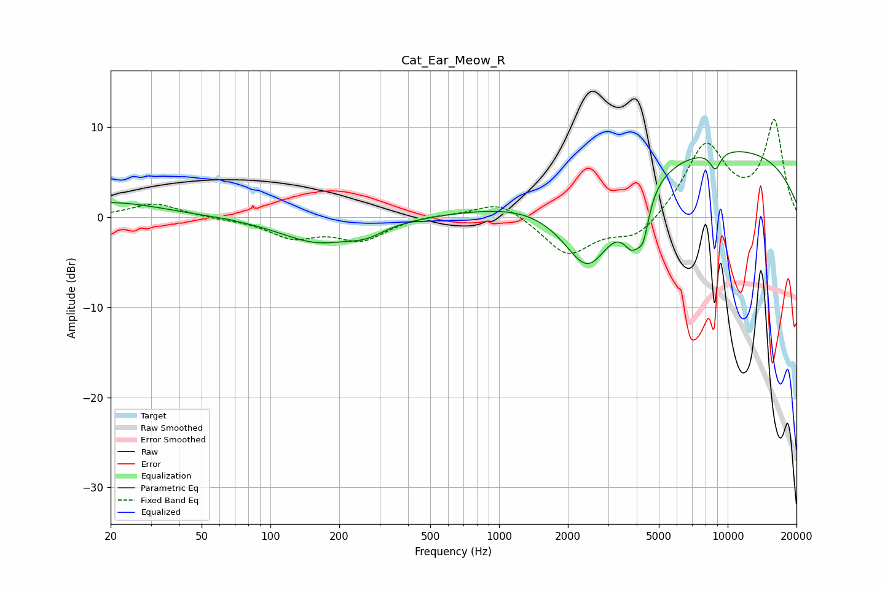

# Cat_Ear_Meow_R
See [usage instructions](https://github.com/jaakkopasanen/AutoEq#usage) for more options and info.

### Parametric EQs
Apply preamp of -7.4 dB when using parametric equalizer.

|   # | Type    |   Fc (Hz) |    Q |   Gain (dB) |
|-----|---------|-----------|------|-------------|
|   1 | Peaking |        20 | 0.62 |         1.7 |
|   2 | Peaking |        64 | 5.91 |         0   |
|   3 | Peaking |       159 | 0.86 |        -2.7 |
|   4 | Peaking |       262 | 1.73 |        -1.1 |
|   5 | Peaking |      2460 | 1.1  |       -10.9 |
|   6 | Peaking |      3838 | 3.23 |        -4.8 |
|   7 | Peaking |      4279 | 5.81 |        -3.3 |
|   8 | Peaking |      6348 | 0.18 |         5.6 |
|   9 | Peaking |      8826 | 5.47 |        -2   |
|  10 | Peaking |      9477 | 0.18 |         2.7 |

### Fixed Band EQs
When using fixed band (also called graphic) equalizer, apply preamp of **-10.9 dB** (if available) and set gains manually with these parameters.

|   # | Type    |   Fc (Hz) |    Q |   Gain (dB) |
|-----|---------|-----------|------|-------------|
|   1 | Peaking |        31 | 1.41 |         1.6 |
|   2 | Peaking |        62 | 1.41 |        -0.1 |
|   3 | Peaking |       125 | 1.41 |        -2.1 |
|   4 | Peaking |       250 | 1.41 |        -2.4 |
|   5 | Peaking |       500 | 1.41 |         0.3 |
|   6 | Peaking |      1000 | 1.41 |         1.9 |
|   7 | Peaking |      2000 | 1.41 |        -4.2 |
|   8 | Peaking |      4000 | 1.41 |        -2.5 |
|   9 | Peaking |      8000 | 1.41 |         8   |
|  10 | Peaking |     16000 | 1.41 |        10.5 |

### Graphs

