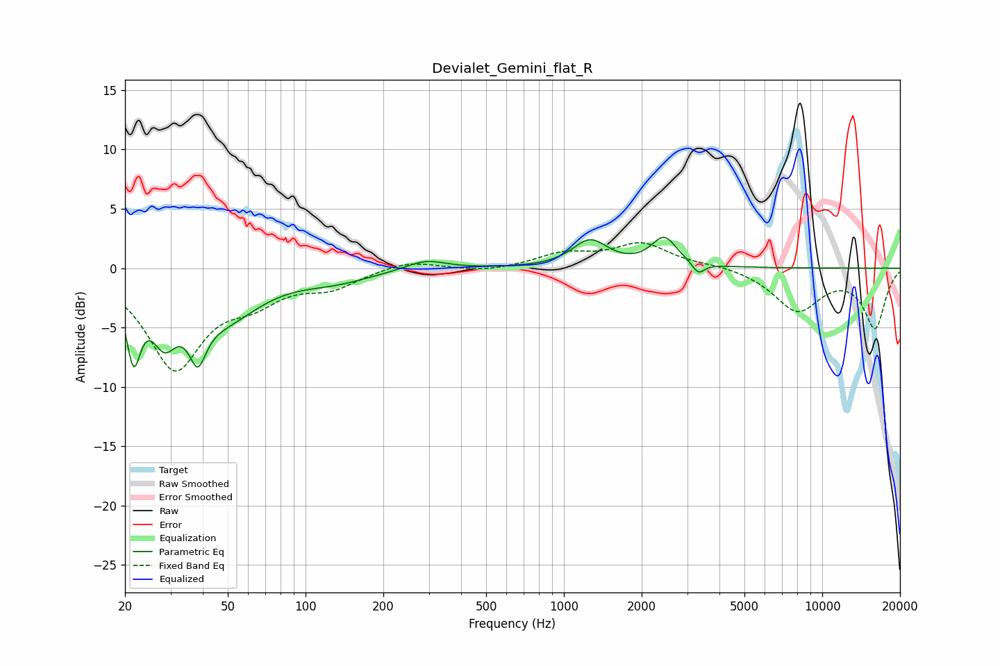

# Devialet_Gemini_flat_R
See [usage instructions](https://github.com/jaakkopasanen/AutoEq#usage) for more options and info.

### Parametric EQs
Apply preamp of -2.7 dB when using parametric equalizer.

|   # | Type    |   Fc (Hz) |    Q |   Gain (dB) |
|-----|---------|-----------|------|-------------|
|   1 | Peaking |        22 | 5.15 |        -6.1 |
|   2 | Peaking |        28 | 2.93 |        -4.1 |
|   3 | Peaking |        38 | 5.58 |         3.1 |
|   4 | Peaking |        38 | 4.74 |        -7.1 |
|   5 | Peaking |        48 | 1    |        -3.8 |
|   6 | Peaking |       131 | 1    |        -0.9 |
|   7 | Peaking |       292 | 1.82 |         0.8 |
|   8 | Peaking |      1262 | 2.1  |         2.3 |
|   9 | Peaking |      2445 | 2.89 |         2.4 |
|  10 | Peaking |      3314 | 6    |        -1   |

### Fixed Band EQs
When using fixed band (also called graphic) equalizer, apply preamp of **-2.2 dB** (if available) and set gains manually with these parameters.

|   # | Type    |   Fc (Hz) |    Q |   Gain (dB) |
|-----|---------|-----------|------|-------------|
|   1 | Peaking |        31 | 1.41 |        -8.3 |
|   2 | Peaking |        62 | 1.41 |        -2   |
|   3 | Peaking |       125 | 1.41 |        -1.4 |
|   4 | Peaking |       250 | 1.41 |         0.7 |
|   5 | Peaking |       500 | 1.41 |        -0.3 |
|   6 | Peaking |      1000 | 1.41 |         1.1 |
|   7 | Peaking |      2000 | 1.41 |         2   |
|   8 | Peaking |      4000 | 1.41 |         0.3 |
|   9 | Peaking |      8000 | 1.41 |        -3.5 |
|  10 | Peaking |     16000 | 1.41 |        -5   |

### Graphs

