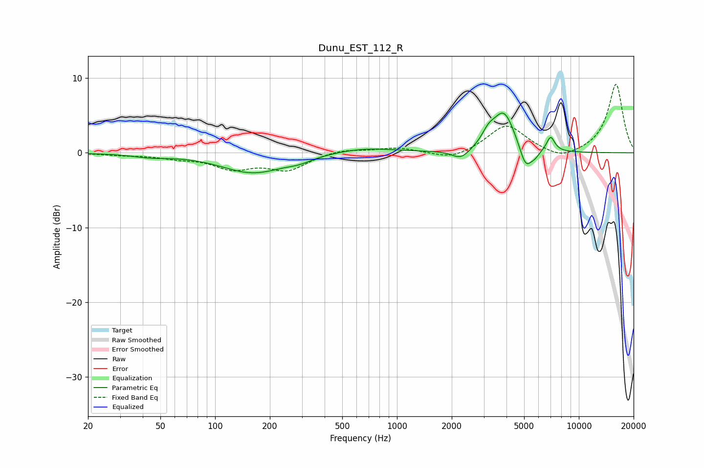

# Dunu_EST_112_R
See [usage instructions](https://github.com/jaakkopasanen/AutoEq#usage) for more options and info.

### Parametric EQs
Apply preamp of -5.4 dB when using parametric equalizer.

|   # | Type    |   Fc (Hz) |    Q |   Gain (dB) |
|-----|---------|-----------|------|-------------|
|   1 | Peaking |        44 | 1.46 |        -0.4 |
|   2 | Peaking |       162 | 0.82 |        -2.7 |
|   3 | Peaking |       291 | 2.05 |        -0.5 |
|   4 | Peaking |       652 | 0.81 |         0.7 |
|   5 | Peaking |      2248 | 2.88 |        -1.3 |
|   6 | Peaking |      3182 | 3.91 |         1.5 |
|   7 | Peaking |      3871 | 2.31 |         5.4 |
|   8 | Peaking |      5097 | 4.16 |        -3   |
|   9 | Peaking |      5727 | 5.03 |        -0.8 |
|  10 | Peaking |      6998 | 5.99 |         2   |

### Fixed Band EQs
When using fixed band (also called graphic) equalizer, apply preamp of **-9.3 dB** (if available) and set gains manually with these parameters.

|   # | Type    |   Fc (Hz) |    Q |   Gain (dB) |
|-----|---------|-----------|------|-------------|
|   1 | Peaking |        31 | 1.41 |        -0.2 |
|   2 | Peaking |        62 | 1.41 |        -0.6 |
|   3 | Peaking |       125 | 1.41 |        -1.9 |
|   4 | Peaking |       250 | 1.41 |        -2.2 |
|   5 | Peaking |       500 | 1.41 |         0.5 |
|   6 | Peaking |      1000 | 1.41 |         0.7 |
|   7 | Peaking |      2000 | 1.41 |        -1   |
|   8 | Peaking |      4000 | 1.41 |         3.8 |
|   9 | Peaking |      8000 | 1.41 |        -1.1 |
|  10 | Peaking |     16000 | 1.41 |         9.3 |

### Graphs

