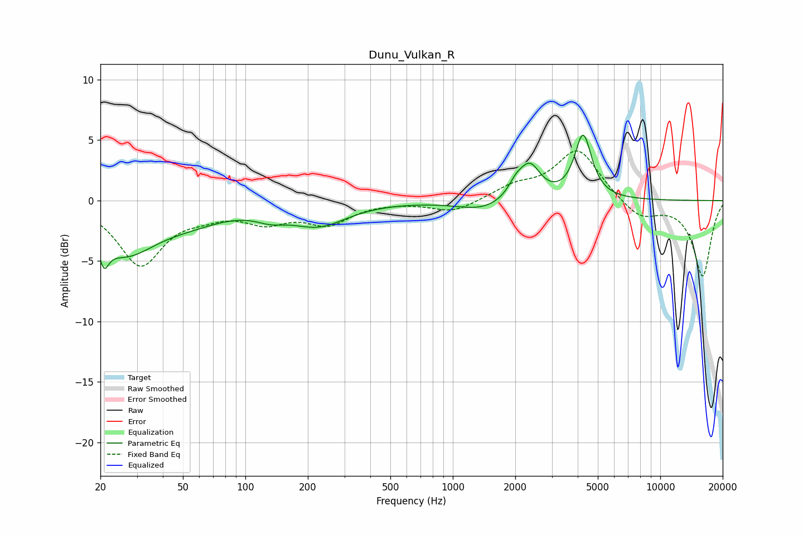

# Dunu_Vulkan_R
See [usage instructions](https://github.com/jaakkopasanen/AutoEq#usage) for more options and info.

### Parametric EQs
Apply preamp of -5.5 dB when using parametric equalizer.

|   # | Type    |   Fc (Hz) |    Q |   Gain (dB) |
|-----|---------|-----------|------|-------------|
|   1 | Peaking |        21 | 5.98 |        -5.2 |
|   2 | Peaking |        21 | 5.84 |         3.3 |
|   3 | Peaking |        26 | 0.95 |        -3.9 |
|   4 | Peaking |        54 | 0.77 |        -1.2 |
|   5 | Peaking |       132 | 1.94 |        -0.7 |
|   6 | Peaking |       225 | 1.02 |        -1.9 |
|   7 | Peaking |      1402 | 1.17 |        -0.8 |
|   8 | Peaking |      2012 | 3.81 |         1   |
|   9 | Peaking |      2351 | 2.74 |         2.8 |
|  10 | Peaking |      4248 | 3.47 |         5.3 |

### Fixed Band EQs
When using fixed band (also called graphic) equalizer, apply preamp of **-4.2 dB** (if available) and set gains manually with these parameters.

|   # | Type    |   Fc (Hz) |    Q |   Gain (dB) |
|-----|---------|-----------|------|-------------|
|   1 | Peaking |        31 | 1.41 |        -5.2 |
|   2 | Peaking |        62 | 1.41 |        -0.8 |
|   3 | Peaking |       125 | 1.41 |        -1.5 |
|   4 | Peaking |       250 | 1.41 |        -1.8 |
|   5 | Peaking |       500 | 1.41 |        -0   |
|   6 | Peaking |      1000 | 1.41 |        -1   |
|   7 | Peaking |      2000 | 1.41 |         1.1 |
|   8 | Peaking |      4000 | 1.41 |         4.2 |
|   9 | Peaking |      8000 | 1.41 |        -1.5 |
|  10 | Peaking |     16000 | 1.41 |        -6.2 |

### Graphs

