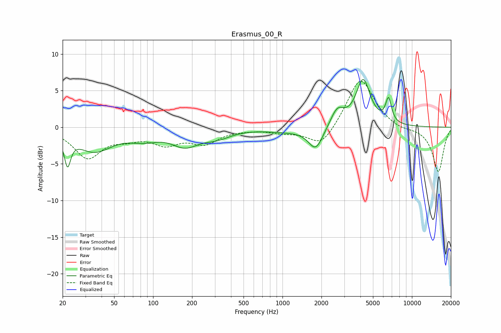

# Erasmus_00_R
See [usage instructions](https://github.com/jaakkopasanen/AutoEq#usage) for more options and info.

### Parametric EQs
Apply preamp of -6.6 dB when using parametric equalizer.

|   # | Type    |   Fc (Hz) |    Q |   Gain (dB) |
|-----|---------|-----------|------|-------------|
|   1 | Peaking |        22 | 5.94 |        -3.9 |
|   2 | Peaking |        35 | 1.04 |        -3.1 |
|   3 | Peaking |        85 | 1.23 |        -1.2 |
|   4 | Peaking |       176 | 1.36 |        -2.1 |
|   5 | Peaking |       310 | 1.27 |        -1.1 |
|   6 | Peaking |      1062 | 0.89 |        -0.5 |
|   7 | Peaking |      1808 | 2.49 |        -3.1 |
|   8 | Peaking |      2649 | 2.69 |         2.4 |
|   9 | Peaking |      4197 | 2.54 |         6.3 |
|  10 | Peaking |      6596 | 5.99 |         3.2 |

### Fixed Band EQs
When using fixed band (also called graphic) equalizer, apply preamp of **-6.4 dB** (if available) and set gains manually with these parameters.

|   # | Type    |   Fc (Hz) |    Q |   Gain (dB) |
|-----|---------|-----------|------|-------------|
|   1 | Peaking |        31 | 1.41 |        -4   |
|   2 | Peaking |        62 | 1.41 |        -1.1 |
|   3 | Peaking |       125 | 1.41 |        -2   |
|   4 | Peaking |       250 | 1.41 |        -2   |
|   5 | Peaking |       500 | 1.41 |        -0.2 |
|   6 | Peaking |      1000 | 1.41 |        -0.6 |
|   7 | Peaking |      2000 | 1.41 |        -2.8 |
|   8 | Peaking |      4000 | 1.41 |         6.9 |
|   9 | Peaking |      8000 | 1.41 |        -0.5 |
|  10 | Peaking |     16000 | 1.41 |        -6.1 |

### Graphs

