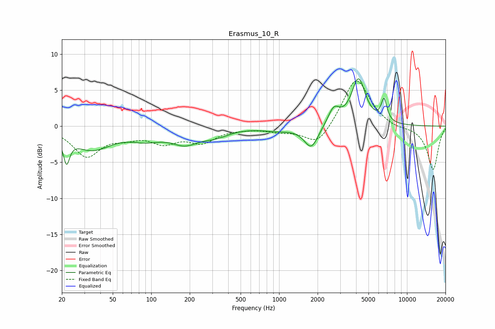

# Erasmus_10_R
See [usage instructions](https://github.com/jaakkopasanen/AutoEq#usage) for more options and info.

### Parametric EQs
Apply preamp of -6.7 dB when using parametric equalizer.

|   # | Type    |   Fc (Hz) |    Q |   Gain (dB) |
|-----|---------|-----------|------|-------------|
|   1 | Peaking |        22 | 5.9  |        -3.5 |
|   2 | Peaking |        34 | 0.93 |        -3.1 |
|   3 | Peaking |        91 | 1.1  |        -1.3 |
|   4 | Peaking |       184 | 1.33 |        -2   |
|   5 | Peaking |       317 | 1.35 |        -1   |
|   6 | Peaking |       981 | 1.13 |        -0.5 |
|   7 | Peaking |      1784 | 2.58 |        -3.1 |
|   8 | Peaking |      2674 | 3.14 |         2.3 |
|   9 | Peaking |      4174 | 2.55 |         6.4 |
|  10 | Peaking |      6619 | 6    |         3.1 |

### Fixed Band EQs
When using fixed band (also called graphic) equalizer, apply preamp of **-6.4 dB** (if available) and set gains manually with these parameters.

|   # | Type    |   Fc (Hz) |    Q |   Gain (dB) |
|-----|---------|-----------|------|-------------|
|   1 | Peaking |        31 | 1.41 |        -4   |
|   2 | Peaking |        62 | 1.41 |        -1.1 |
|   3 | Peaking |       125 | 1.41 |        -2   |
|   4 | Peaking |       250 | 1.41 |        -2   |
|   5 | Peaking |       500 | 1.41 |        -0.2 |
|   6 | Peaking |      1000 | 1.41 |        -0.6 |
|   7 | Peaking |      2000 | 1.41 |        -2.8 |
|   8 | Peaking |      4000 | 1.41 |         6.9 |
|   9 | Peaking |      8000 | 1.41 |        -0.4 |
|  10 | Peaking |     16000 | 1.41 |        -6.1 |

### Graphs

