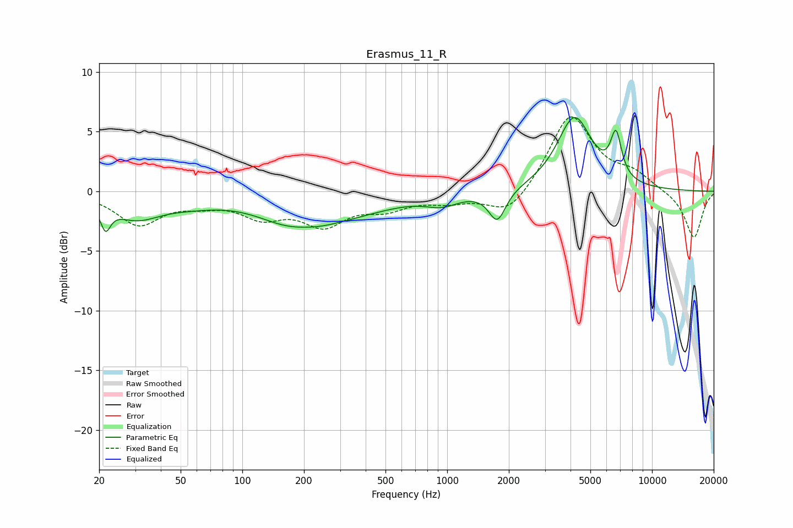

# Erasmus_11_R
See [usage instructions](https://github.com/jaakkopasanen/AutoEq#usage) for more options and info.

### Parametric EQs
Apply preamp of -6.3 dB when using parametric equalizer.

|   # | Type    |   Fc (Hz) |    Q |   Gain (dB) |
|-----|---------|-----------|------|-------------|
|   1 | Peaking |        21 | 5.91 |        -2   |
|   2 | Peaking |        30 | 1.16 |        -2   |
|   3 | Peaking |        56 | 0.96 |        -0.6 |
|   4 | Peaking |       192 | 0.8  |        -3.1 |
|   5 | Peaking |       198 | 1.44 |         0.6 |
|   6 | Peaking |       393 | 0.7  |        -0.9 |
|   7 | Peaking |       945 | 1.73 |        -0.9 |
|   8 | Peaking |      1756 | 3.43 |        -2.6 |
|   9 | Peaking |      4183 | 1.66 |         6.2 |
|  10 | Peaking |      6671 | 5.15 |         3.6 |

### Fixed Band EQs
When using fixed band (also called graphic) equalizer, apply preamp of **-6.3 dB** (if available) and set gains manually with these parameters.

|   # | Type    |   Fc (Hz) |    Q |   Gain (dB) |
|-----|---------|-----------|------|-------------|
|   1 | Peaking |        31 | 1.41 |        -2.7 |
|   2 | Peaking |        62 | 1.41 |        -0.7 |
|   3 | Peaking |       125 | 1.41 |        -1.8 |
|   4 | Peaking |       250 | 1.41 |        -2.5 |
|   5 | Peaking |       500 | 1.41 |        -1.2 |
|   6 | Peaking |      1000 | 1.41 |        -0.7 |
|   7 | Peaking |      2000 | 1.41 |        -2.1 |
|   8 | Peaking |      4000 | 1.41 |         6.5 |
|   9 | Peaking |      8000 | 1.41 |         1.3 |
|  10 | Peaking |     16000 | 1.41 |        -4   |

### Graphs

