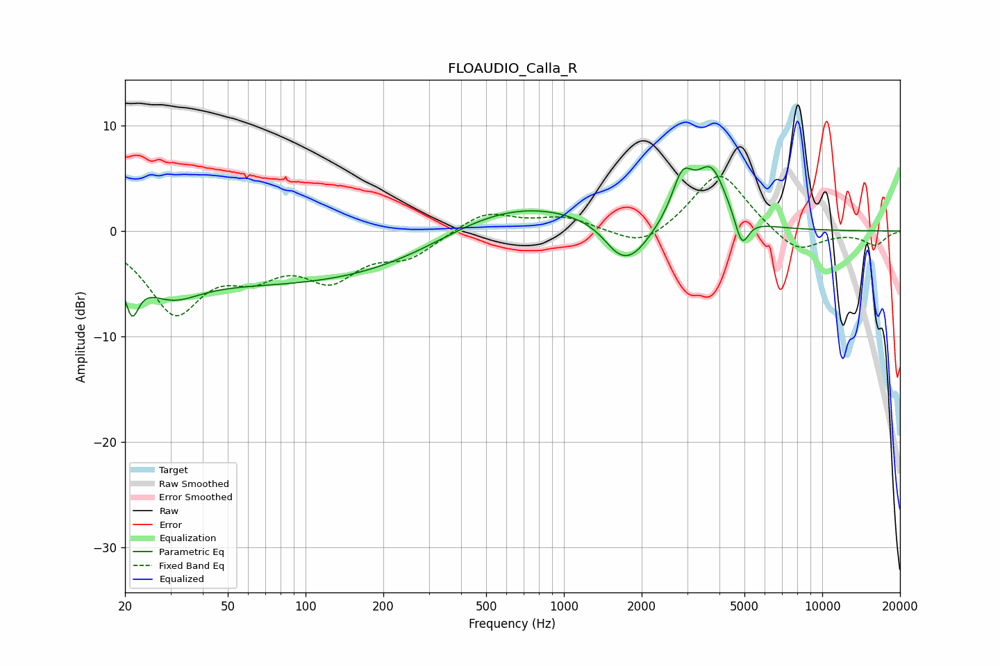

# FLOAUDIO_Calla_R
See [usage instructions](https://github.com/jaakkopasanen/AutoEq#usage) for more options and info.

### Parametric EQs
Apply preamp of -6.2 dB when using parametric equalizer.

|   # | Type    |   Fc (Hz) |    Q |   Gain (dB) |
|-----|---------|-----------|------|-------------|
|   1 | Peaking |        21 | 5.45 |        -3.8 |
|   2 | Peaking |        30 | 1.3  |        -2.6 |
|   3 | Peaking |       105 | 0.18 |        -5.1 |
|   4 | Peaking |       484 | 0.55 |         3   |
|   5 | Peaking |       821 | 0.56 |         1.7 |
|   6 | Peaking |      1599 | 2.61 |        -1.2 |
|   7 | Peaking |      1831 | 1.84 |        -3.1 |
|   8 | Peaking |      2877 | 3.4  |         4.2 |
|   9 | Peaking |      3718 | 2.34 |         5.4 |
|  10 | Peaking |      4882 | 5.28 |        -3   |

### Fixed Band EQs
When using fixed band (also called graphic) equalizer, apply preamp of **-5.3 dB** (if available) and set gains manually with these parameters.

|   # | Type    |   Fc (Hz) |    Q |   Gain (dB) |
|-----|---------|-----------|------|-------------|
|   1 | Peaking |        31 | 1.41 |        -7.3 |
|   2 | Peaking |        62 | 1.41 |        -3   |
|   3 | Peaking |       125 | 1.41 |        -4   |
|   4 | Peaking |       250 | 1.41 |        -2.2 |
|   5 | Peaking |       500 | 1.41 |         1.9 |
|   6 | Peaking |      1000 | 1.41 |         1.2 |
|   7 | Peaking |      2000 | 1.41 |        -1.8 |
|   8 | Peaking |      4000 | 1.41 |         5.8 |
|   9 | Peaking |      8000 | 1.41 |        -2.2 |
|  10 | Peaking |     16000 | 1.41 |        -1.3 |

### Graphs

