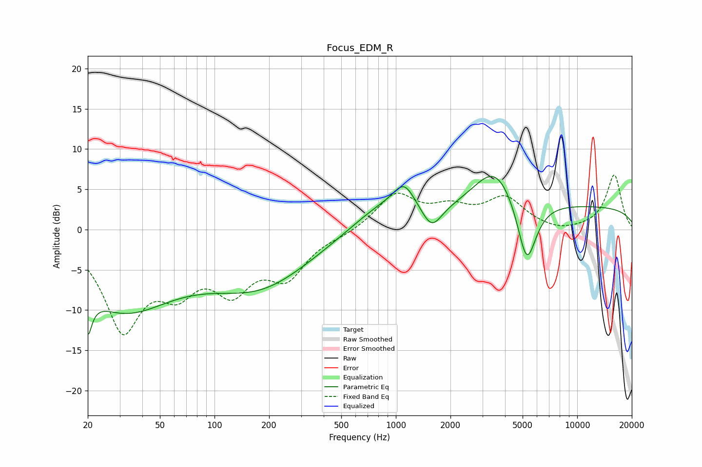

# Focus_EDM_R
See [usage instructions](https://github.com/jaakkopasanen/AutoEq#usage) for more options and info.

### Parametric EQs
Apply preamp of -6.7 dB when using parametric equalizer.

|   # | Type    |   Fc (Hz) |    Q |   Gain (dB) |
|-----|---------|-----------|------|-------------|
|   1 | Peaking |        20 | 5.78 |        -8.5 |
|   2 | Peaking |        20 | 5.58 |         3.5 |
|   3 | Peaking |        31 | 0.48 |        -9.4 |
|   4 | Peaking |       180 | 0.48 |        -6.4 |
|   5 | Peaking |       828 | 0.8  |         3.1 |
|   6 | Peaking |      1112 | 2.35 |         3.2 |
|   7 | Peaking |      1577 | 2.6  |        -2.9 |
|   8 | Peaking |      3543 | 1.14 |         5.8 |
|   9 | Peaking |      5267 | 2.52 |        -8.6 |
|  10 | Peaking |     10000 | 0.18 |         2.8 |

### Fixed Band EQs
When using fixed band (also called graphic) equalizer, apply preamp of **-6.9 dB** (if available) and set gains manually with these parameters.

|   # | Type    |   Fc (Hz) |    Q |   Gain (dB) |
|-----|---------|-----------|------|-------------|
|   1 | Peaking |        31 | 1.41 |       -11.7 |
|   2 | Peaking |        62 | 1.41 |        -5.5 |
|   3 | Peaking |       125 | 1.41 |        -6.3 |
|   4 | Peaking |       250 | 1.41 |        -5.2 |
|   5 | Peaking |       500 | 1.41 |        -0.5 |
|   6 | Peaking |      1000 | 1.41 |         4.3 |
|   7 | Peaking |      2000 | 1.41 |         2.2 |
|   8 | Peaking |      4000 | 1.41 |         3.7 |
|   9 | Peaking |      8000 | 1.41 |        -0.5 |
|  10 | Peaking |     16000 | 1.41 |         6.8 |

### Graphs

